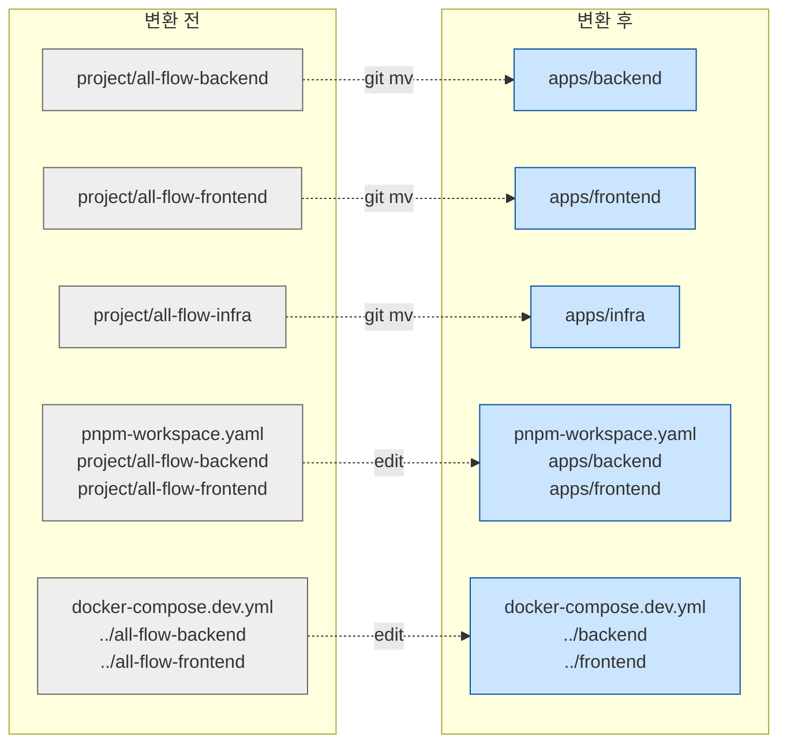

# Design — monorepo-step2-folder-move-2026-04-30

> **Generated**: 2026-04-30 by av-do-orchestrator (PL)
> **Source Plan**: `docs/01-plan/features/monorepo-step2-folder-move-2026-04-30.plan.md`
> **Scope**: 정확한 git mv 시퀀스 + 6 파일 patch 명세

---

## 1. 실행 시퀀스

### 1.1 baseline commit (rollback 기준점)

본 사이클 시작 시점의 dirty state(Step 1 자산 + single-port-localhost 자산 + 부수 BE/FE 변경)를 한 commit으로 압축. 게이트 실패 시 `git reset --hard <baseline>` 단일 명령으로 회귀.

```bash
git add -A   # untracked + modified 모두 포함
git commit -s -m "chore(monorepo): baseline before Step 2 folder move"
BASELINE_SHA=$(git rev-parse HEAD)
echo "$BASELINE_SHA" > /tmp/allflow-step2-baseline.sha
```

### 1.2 git mv 3건

```bash
mkdir -p apps
git mv project/all-flow-backend  apps/backend
git mv project/all-flow-frontend apps/frontend
git mv project/all-flow-infra    apps/infra
# project/ 가 비었는지 검증 후 삭제
rmdir project
```

git는 자동 rename detection으로 모든 하위 파일의 history를 보존한다.

### 1.3 6 파일 patch

#### (a) `/data/allflow/pnpm-workspace.yaml`

```diff
-# Step 1 (2026-04-30): BE + FE only. infra has no package.json (Makefile-driven).
-# Step 3+ will activate packages/* and apps/* after folder migration.
+# Step 2 (2026-04-30): folder migrated to apps/. infra has no package.json (Makefile-driven, excluded).
+# Step 3+ will activate packages/*.
 packages:
-  - 'project/all-flow-backend'
-  - 'project/all-flow-frontend'
-  # - 'packages/*'   # Step 3+ (contracts, shared, config-*)
-  # - 'apps/*'       # Step 2 (after git mv project/all-flow-* → apps/*)
+  - 'apps/backend'
+  - 'apps/frontend'
+  # - 'packages/*'   # Step 3+ (contracts, shared, config-*)
```

#### (b) `apps/infra/docker-compose.dev.yml`

```diff
   backend:
     image: allflow-backend:dev
     build:
-      context: ../all-flow-backend
+      context: ../backend
       dockerfile: Dockerfile
       target: dev
     ...
     volumes:
-      - ../all-flow-backend:/app
+      - ../backend:/app
       - backend-node-modules:/app/node_modules
     ...

   frontend:
     image: allflow-frontend:dev
     build:
-      context: ../all-flow-frontend
+      context: ../frontend
       dockerfile: Dockerfile
       target: dev
     ...
     volumes:
-      - ../all-flow-frontend:/app
+      - ../frontend:/app
       - frontend-node-modules:/app/node_modules
       - frontend-next-cache:/app/.next
```

env 섹션은 변경 0건 (single-port 정합 유지 — 절대조건 C5).

#### (c) `apps/infra/docker-compose.prod.yml`

```diff
   backend:
     image: ${BACKEND_IMAGE:-allflow-backend:latest}
     build:
-      context: ../all-flow-backend
+      context: ../backend
       dockerfile: Dockerfile
       target: runtime
     ...

   frontend:
     image: ${FRONTEND_IMAGE:-allflow-frontend:latest}
     build:
-      context: ../all-flow-frontend
+      context: ../frontend
       dockerfile: Dockerfile
       target: prod
```

#### (d) `.claude/agents/av-base-browser-tester.md` — 5곳 일괄 치환

```
project/all-flow-frontend → apps/frontend
```

#### (e) `apps/backend/prisma/seed.ts` (주석 1줄)

```diff
- *   project/all-flow-frontend/src/lib/fixtures.ts (TEAM/PROJECTS/TASKS/ISSUES)
+ *   apps/frontend/src/lib/fixtures.ts (TEAM/PROJECTS/TASKS/ISSUES)
```

#### (f) `apps/backend/tests/integration/frontend-contract-mirror.test.ts` (주석 1줄)

```diff
- * Source: project/all-flow-frontend/openapi.yaml
+ * Source: apps/frontend/openapi.yaml
```

---

## 2. 변경하지 않는 것 (Negative Space)

| 영역 | 이유 |
|------|------|
| `apps/infra/docker-compose.yml` (base) | path 참조 0건 |
| dev/prod compose env 섹션 (NEXTAUTH_URL/BACKEND_URL/...) | 절대조건 C5 |
| `apps/backend/prisma/schema.prisma` | 절대조건 C4 |
| `apps/backend/package.json` / `apps/frontend/package.json` | name/version/scripts 그대로 |
| `apps/backend/Dockerfile` / `apps/frontend/Dockerfile` | 빌드 컨텍스트 내 상대경로 그대로 |
| `apps/backend/src/**` / `apps/frontend/src/**` | 코드 0줄 변경 |
| `apps/backend/pnpm-lock.yaml` / `apps/frontend/pnpm-lock.yaml` | root install 금지 (Step 3) |
| `apps/infra/Makefile` | 변경 없음 — 기존 호출 위치 = `apps/infra/`, COMPOSE 명령은 cwd 기준 |
| `apps/infra/scripts/wait-for-healthy.sh` | 상대 호출, 변경 없음 |
| `apps/infra/.env.dev` / `.env.prod` | 0줄 |
| 루트 `package.json` / `turbo.json` / `tsconfig.base.json` | 0줄 (Step 1 자산은 path 미언급) |
| `docs/archive/**` | 과거 자산 |

---

## 3. 검증 매트릭스 (Do 단계 자동화 — 게이트 11건 시퀀스)

```bash
set -e
cd /data/allflow

# G1: 폴더 이동
test -d apps/backend
test -d apps/frontend
test -d apps/infra
test ! -d project

# G2: workspaces 갱신
node -e "
const yaml = require('./apps/backend/node_modules/yaml');
const fs = require('fs');
const cfg = yaml.parse(fs.readFileSync('pnpm-workspace.yaml','utf8'));
if (!cfg.packages.includes('apps/backend')) throw new Error('apps/backend 누락');
if (!cfg.packages.includes('apps/frontend')) throw new Error('apps/frontend 누락');
console.log('workspaces OK:', cfg.packages);
"

# G3: compose config 검증
(cd apps/infra && docker compose -f docker-compose.yml -f docker-compose.dev.yml --env-file .env.dev config -q)
(cd apps/infra && docker compose -f docker-compose.yml -f docker-compose.prod.yml --env-file .env.prod config -q) || true  # prod env 미존재 시 skip

# G4: dev healthy
(cd apps/infra && make up ENV=dev)   # internal: docker compose up -d + wait-for-healthy.sh

# G5: localhost health
curl -fsS http://localhost/health

# G6 (R1 Critical): Playwright
(cd apps/frontend && E2E_BASE_URL=http://localhost pnpm exec playwright test tests/e2e/user-flows.spec.ts --reporter=line)
# 기준: pass count ≥ 56

# G7: BE 회귀
(cd apps/backend && pnpm typecheck)
(cd apps/backend && pnpm test)  # unit 188+

# G8: FE 회귀
(cd apps/frontend && pnpm typecheck)
(cd apps/frontend && pnpm test)  # vitest 98+

# G10: Prisma 불변
git diff --quiet -- apps/backend/prisma/schema.prisma
```

게이트 실패 시 즉시:
```bash
BASELINE=$(cat /tmp/allflow-step2-baseline.sha)
git reset --hard "$BASELINE"
(cd apps/infra && make down ENV=dev) || (cd project/all-flow-infra && make down ENV=dev) || true
```

---

## 4. Mermaid — Step 2 변환



---

## 5. Acceptance Criteria

- [ ] G1: `apps/{backend,frontend,infra}` 존재 & `project/` 미존재
- [ ] G2: pnpm-workspace.yaml에 `apps/backend` + `apps/frontend` 등록
- [ ] G3: `docker compose config -q` exit 0 (dev)
- [ ] G4: 4 서비스 healthy (postgres/redis/backend/frontend)
- [ ] G5: `curl http://localhost/health` 200
- [ ] G6: Playwright `user-flows.spec.ts` ≥ 56/62 (R1 Critical)
- [ ] G7: BE typecheck (no new errors) + unit 188+ PASS
- [ ] G8: FE typecheck 0 + vitest 98+ PASS
- [ ] G10: schema.prisma diff empty
- [ ] G11: match_rate ≥ 0.90 (bkit:gap-detector)

**모두 PASS 시 머지 승인 → bkit report → memory-keeper 학습 저장**

---

**End of Design** — 다음 액션: baseline commit → git mv → 6 patch → gates → bkit report
