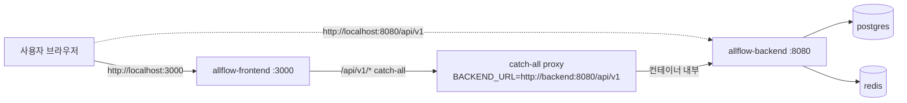
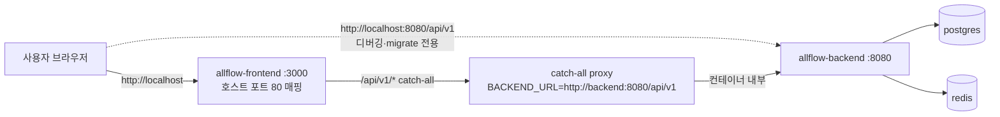
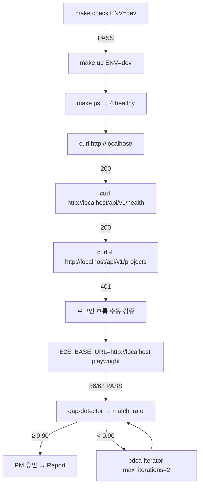
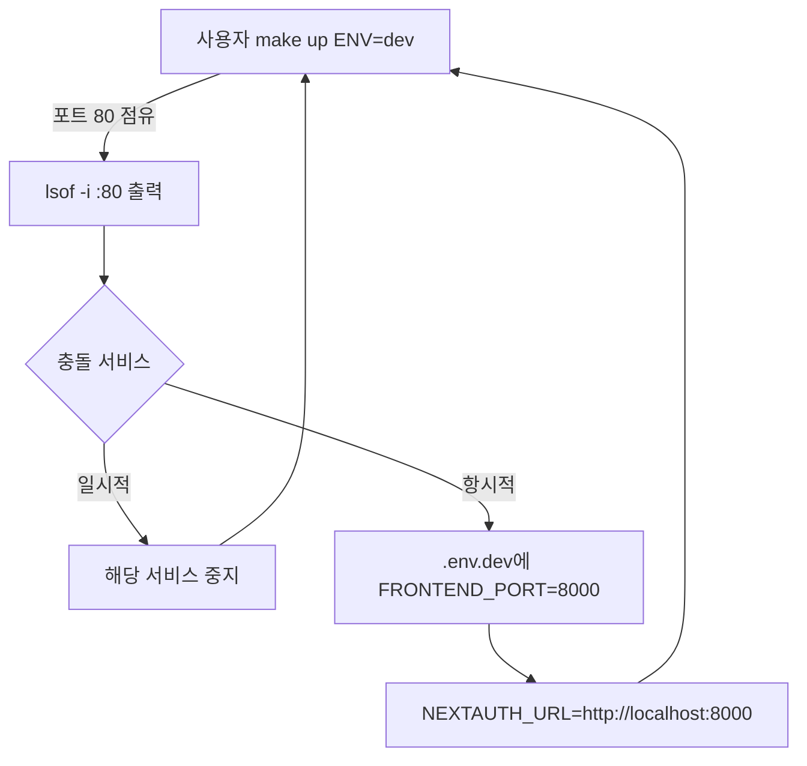

# Design — 단일 포트 localhost 최적화 (2026-04-30)

> feature: `single-port-localhost-2026-04-30` | 작성: av-do-orchestrator | 2026-04-30
> Plan: `docs/01-plan/features/single-port-localhost-2026-04-30.plan.md`

## 1. 아키텍처 개요

### 1.1 변경 전 (현재)



문제: 사용자가 두 포트(3000/8080)를 알아야 함. NEXTAUTH_URL이 `:3000` 포함.

### 1.2 변경 후 (목표)



핵심: 사용자는 `http://localhost`만 사용. BE 8080은 디버깅·prisma migrate·헬스체크용으로 유지.

## 2. 포트 매핑 매트릭스

| 서비스 | 컨테이너 포트 | 호스트 포트 (변경 후) | 호스트 포트 (변경 전) | 용도 |
|--------|--------------|--------------------|--------------------|------|
| frontend | 3000 | **80** | 3000 | 사용자 진입점 (FE 페이지 + catch-all API) |
| backend | 8080 | 8080 | 8080 | 직접 디버깅·migrate (변경 없음) |
| postgres | 5432 | 5432 (dev only) | 5432 | DB 직접 접근 (dev only) |
| redis | 6379 | 6379 (dev only) | 6379 | Redis CLI (dev only) |

## 3. 환경 변수 변경

| 변수 | 변경 전 | 변경 후 | 적용 위치 |
|------|---------|---------|-----------|
| `FRONTEND_PORT` (default) | `3000` | `80` | `compose.dev.yml`, `compose.prod.yml` |
| `NEXTAUTH_URL` (dev default) | `http://localhost:3000` | `http://localhost` | `compose.dev.yml` |
| `NEXTAUTH_URL` (prod) | required | required (`http://localhost` 또는 도메인) | `.env.prod` 사용자 갱신 |
| `NEXT_PUBLIC_API_URL` | `http://localhost:8080/api/v1` (dev) / `/api/v1` (prod) | `/api/v1` 권장 | dev에서도 동일 origin 통일 (선택) |
| `BACKEND_URL` | `http://backend:8080/api/v1` | (변경 없음) | 컨테이너 내부 통신 |

## 4. 변경 파일 명세

### 4.1 `project/all-flow-infra/docker-compose.dev.yml`

```yaml
  frontend:
    environment:
      NEXTAUTH_URL: ${NEXTAUTH_URL:-http://localhost}        # CHG: :3000 제거
      BACKEND_URL: ${BACKEND_URL:-http://backend:8080/api/v1}
      NEXT_PUBLIC_API_URL: ${NEXT_PUBLIC_API_URL:-/api/v1}    # CHG: 동일 origin 통일 (선택)
    ports:
      - "${FRONTEND_PORT:-80}:3000"                           # CHG: 기본값 80
```

### 4.2 `project/all-flow-infra/docker-compose.prod.yml`

```yaml
  frontend:
    ports:
      - "${FRONTEND_PORT:-80}:3000"                           # CHG: 기본값 80
```

### 4.3 `project/all-flow-infra/.env.dev` (사용자 수동, 가이드)

```bash
# 단일 호스트 진입 (포트 80)
FRONTEND_PORT=80
NEXTAUTH_URL=http://localhost
NEXT_PUBLIC_API_URL=/api/v1
# 80 충돌 시 폴백 예: FRONTEND_PORT=8000, NEXTAUTH_URL=http://localhost:8000
```

### 4.4 `project/all-flow-infra/.env.prod` (사용자 수동, 가이드)

```bash
FRONTEND_PORT=80
NEXTAUTH_URL=http://localhost
NEXT_PUBLIC_API_URL=/api/v1
```

## 5. 인증·세션 흐름 (변경 없음, URL만 갱신)

```mermaid
sequenceDiagram
    participant B as 브라우저
    participant FE as Next.js (호스트:80)
    participant CA as catch-all proxy
    participant BE as Fastify (컨테이너:8080)

    B->>FE: GET http://localhost/login
    FE-->>B: 로그인 폼 (next-auth Credentials)
    B->>CA: POST /api/v1/auth/login (쿠키 없음)
    CA->>BE: POST http://backend:8080/api/v1/auth/login
    BE-->>CA: 200 { token }
    CA-->>B: Set-Cookie: next-auth.session-token=...; domain=localhost
    Note over B,FE: 이후 요청
    B->>CA: GET /api/v1/projects (쿠키)
    CA->>CA: auth() → session.accessToken 추출
    CA->>BE: GET .../projects (Authorization: Bearer ...)
    BE-->>CA: 200 [...]
    CA-->>B: 200 [...]
```

핵심: 쿠키 도메인이 `localhost`로 통일 (포트 무관). next-auth는 `NEXTAUTH_URL`을 토큰 issuer로 사용하므로 `http://localhost`로 일치 필수.

## 6. 검증 시퀀스



## 7. 폴백 전략



WSL2 사용자: `~/.wslconfig`에 `[wsl2] networkingMode=mirrored` 권장.

## 8. 데이터·시그니처 영향 0건

- BE 라우트: 변경 없음
- FE 페이지: 변경 없음
- catch-all proxy: 변경 없음 (BACKEND_URL 그대로)
- next-auth Credentials.authorize: 변경 없음
- Prisma schema: 변경 없음
- 단위 테스트 path: 변경 없음

## 9. 보안 고려

| 항목 | 검토 |
|------|------|
| 포트 80 평문 노출 (prod) | 비목표. 운영 ingress(traefik+TLS)로 별도 사이클 처리 |
| 쿠키 SameSite | next-auth 기본 `lax` 유지 (도메인 동일 origin이라 영향 없음) |
| CORS | 동일 origin이라 CORS 무관 (catch-all proxy로 흡수) |
| BE 8080 직접 노출 | dev/prod 모두 유지 — 디버깅 편의 우선. prod에서 80만 외부 노출하려면 별도 사이클에서 8080 publish 제거 |

## 10. 모니터링·관측

- `curl http://localhost/api/v1/health` smoke (dev)
- `curl http://localhost:8080/health` BE 직접 헬스
- docker compose healthcheck 4 서비스 healthy
- Playwright HTML 리포트(CI 시)

## 11. 롤백

```bash
git revert <commit>          # compose 변경 되돌림
make restart ENV=dev         # 재기동
# 또는 .env.dev에서 FRONTEND_PORT=3000 NEXTAUTH_URL=http://localhost:3000 override
```

롤백 영향: FE/BE 코드 0건 변경이므로 즉시 복귀 가능.

## 12. 사용자 승인 게이트 (next)

`av-base-stack-approval` 훅이 다음 파일 변경 직전 차단:
- `project/all-flow-infra/docker-compose.dev.yml`
- `project/all-flow-infra/docker-compose.prod.yml`

사용자 승인 후 Do 진입 → S1~S5 실행 → gap-detector 측정 → Report.
