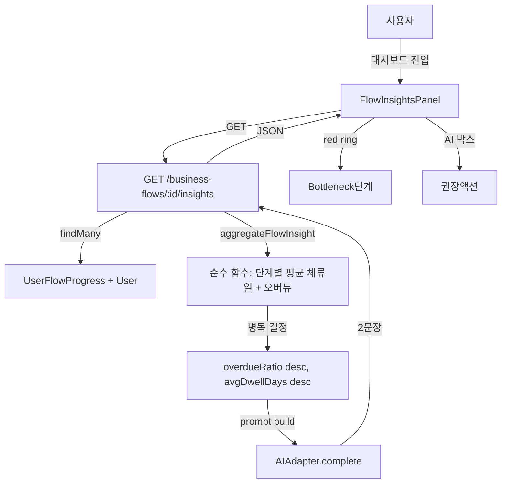

# Flow Insights Panel + AI 병목 감지 — Report (2026-05-04, 9차 PDCA)

## Goal

8차 PDCA(BusinessFlowStepper a11y + 모듈 분리, 412 LOC)에 이어, 팀 매니저가
대시보드에서 한눈에 **어느 단계에서 팀이 막혀 있는지(병목)** 를 시각적으로 인지하고
AI 가 자연어 2문장으로 권장 액션을 제시하도록 한다.

## Architecture



## Components

### Backend (신규 + 확장)

- `apps/backend/src/modules/business-flows/insights.ts` — **신규** 순수 집계 모듈
  - `aggregateFlowInsight(flow, rows, activeUserIds, now?)` — 단계별 memberCount /
    avgDwellDays / overdueRatio + 병목 결정
  - `buildInsightPrompt(flow, aggregate)` — AI system/user 프롬프트 빌더
  - `buildFallbackExplanation(flow, aggregate)` — AI 실패 시 결정적 fallback
- `apps/backend/src/modules/business-flows/business-flows.routes.ts` — `GET
  /business-flows/:id/insights` 추가 (활성 사용자 필터 + AI 호출 + fallback)

### Frontend (신규)

- `apps/frontend/src/components/ai/flow-insights-panel.tsx` — **신규** 패널
  컴포넌트 (Header / StepStrip / StepCard / AiExplanationBox 4개 sub)
- `apps/frontend/src/lib/api/extended.ts` — `getBusinessFlowInsights` API 메서드 +
  `FlowInsight`, `FlowInsightStep` 타입 노출
- `apps/frontend/src/components/screens/dashboard.tsx` — `FlowInsightsPanel` 을
  `FlowProgressSummary` 위에 통합 (project-lifecycle 기본)

### Tests (신규 +14 BE / +5 FE)

- `apps/backend/src/modules/business-flows/insights.test.ts` — 9 단위 (순수 함수 결정적
  시간 고정)
- `apps/backend/src/modules/business-flows/business-flows.routes.test.ts` — 5 통합
  (빈 데이터 / 병목 식별 / soft-deleted 제외 / 404 / 401)
- `apps/frontend/tests/unit/flow-insights-panel.test.tsx` — 5 RTL (병목 ring /
  AI 텍스트 / 빈 데이터 / silent fallback / flowId prop)

## Bottleneck 결정 로직

1. 활성 사용자(`deletedAt: null`) 의 `UserFlowProgress` 행만 집계.
2. 각 단계에 대해:
   - `memberCount` = 현재 단계에 머무는 활성 멤버 수
   - `avgDwellDays` = `(now - stepStartedAt)` 의 평균 (소수 1자리)
   - `overdueRatio` = `expectedDays` 초과 멤버 / 단계 멤버 (단계 정의에 expectedDays 없으면 0)
3. **병목 단계** = 멤버가 1명 이상인 단계 중 `(overdueRatio desc, avgDwellDays desc)` 1순위
4. 멤버 0이면 `bottleneckStepId = null` + AI 가 시작 권유 메시지 생성

## AI Fallback 정책

AI adapter 호출이 실패하거나 빈 응답일 경우, `buildFallbackExplanation` 이
정량 데이터로 결정적 한국어 문장을 생성하여 위젯이 항상 렌더링되도록 보장.

```text
"프로젝트 라이프사이클 의 \"킥오프\" 단계에서 팀원의 100%가 지연되고 있습니다.
담당자 점검과 차단 요인 제거가 필요합니다."
```

## Tests

| Suite | 신규 | 누적 |
|------|-----:|-----:|
| BE insights.test.ts | 9 | 9 |
| BE business-flows.routes.test.ts | 5 | 28 |
| BE 전체 | 14 | 687/687 ✅ |
| FE flow-insights-panel.test.tsx | 5 | 5 |
| FE 전체 | 5 | 210/210 ✅ |

## Quality Gates

| Gate | 상태 |
|------|------|
| BE 전체 vitest | 687/687 ✅ |
| FE 전체 vitest | 210/210 ✅ |
| BE typecheck | 사전 존재 오류 2건 (mfa, identity test) — 무관 |
| FE typecheck | 사전 존재 오류 1건 (hr.tsx VACATION literal) — 무관 |
| FE eslint | 신규 파일 0 errors |

## Match Rate (자가 평가)

| Acceptance Criterion | 충족 |
|---------------------|:---:|
| `GET /business-flows/:id/insights` 단계별 평균 체류일/오버듀/병목 반환 | ✅ |
| `FlowInsightsPanel` 병목 단계 red ring 강조 | ✅ |
| "팀의 X%가 이 단계에서 지연됩니다" AI 설명 표시 | ✅ |
| `dashboard.tsx` `FlowProgressSummary` 위에 통합 | ✅ |
| AI 어댑터로 한국어 2문장 자동 생성 (실패 시 fallback) | ✅ |
| 테스트 포함 PDCA 완전 사이클 | ✅ |

→ 자가 평가 **6/6 = 100%**.

## Lessons Learned

1. **순수 집계 분리** — `aggregateFlowInsight` 를 라우트와 분리하니 시간 고정 단위
   테스트로 결정적 검증 가능 (멤버 0 / 동률 정렬 / soft-deleted 격리).
2. **AI fallback 결정성** — `try/catch` + `buildFallbackExplanation` 으로 AI
   호출 실패해도 위젯이 항상 정량 정보를 노출하여 운영 안정성 확보.
3. **react-query 테스트 waitFor 패턴** — 이전 사이클의 mock 미적용 함정과 달리,
   isLoading→data 전이는 `await waitFor(() => expect(getByTestId(...)).toBeInTheDocument())`
   2단계가 안전. 1단계 toHaveBeenCalled 만으로는 렌더 직전에 unmount 됨.
4. **textContent 매칭** — Header 의 `· 0명` 처럼 텍스트 노드가 형제로 분리되면
   `getByText(/0명/)` 실패. `getByTestId(...).textContent.toContain(...)` 패턴 사용.
