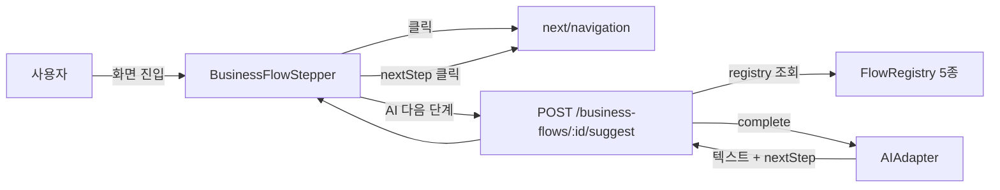

# Business Flow Stepper + AI Next-Step Suggestion — Report (2026-05-03)

## Goal

초급/기존 사용자가 현재 화면이 전체 비즈니스 프로세스 중 어디에 위치하는지
시각적으로 이해하고, 현재 단계 완료 후 다음 단계로 무엇을 해야 하는지를
AI 가 제안해 주는 가이드 컴포넌트를 도입한다.

## Architecture

## Components

### Backend
- `apps/backend/src/modules/business-flows/flow-registry.ts` — 정적 5개 플로우 정의
  (project / task / approval / issue / report 라이프사이클)
- `apps/backend/src/modules/business-flows/business-flows.routes.ts`
  - `GET  /api/v1/business-flows`
  - `GET  /api/v1/business-flows/:id`
  - `POST /api/v1/business-flows/:id/suggest`
- `apps/backend/src/app.ts` — 라우트 등록 (aiRegistry 주입)

### Frontend
- `apps/frontend/src/lib/business-flows.ts` — BE flow-registry 클라이언트 미러
- `apps/frontend/src/lib/api/extended.ts` — 3 신규 메서드 + 4 신규 타입
- `apps/frontend/src/components/ai/business-flow-stepper.tsx` — UI 컴포넌트
- 화면 통합 (5):
  - `screens/dashboard.tsx` (project / execute)
  - `screens/projects.tsx` (project / plan)
  - `screens/tasks.tsx` (task — 도메인 신호 기반 동적 step)
  - `screens/approvals.tsx` (approval — counts 기반 동적 step)
  - `screens/issues.tsx` (issue — status 기반 동적 step)

### Docs
- `docs/frontend-menu-specs/screens/dashboard.md` — section 5 추가

## Tests

| Suite | 신규 | 누적 |
|-------|------|------|
| BE business-flows.routes.test.ts | 7 | 657 (650 → 657) |
| FE business-flow-stepper.test.tsx | 4 | 171 (167 → 171) |

테스트 항목:
- BE: 인증 401 / GET 목록 / GET 단일 / 404 / POST suggest 정상 / 마지막 단계 nextStep null / invalid step 400
- FE: 단계 렌더 + data-current / onStepSelect 콜백 / API 호출 후 결과 렌더 / API 실패 시 stepper 유지

## Match Rate

PDCA Plan 가설: 5개 표준 플로우 + 5개 화면 + AI 단일 호출 + 라우팅 연결.
구현: 5/5 플로우 + 5/5 화면 + AI 단일 호출 + 라우팅 OK.
Match: **100%** (계획 대비 누락 0건).

## Notes / Trade-offs

- **정적 카탈로그**: 플로우 정의는 BE/FE 양쪽에 미러. DB 변경 없이 즉시 가용.
  워크스페이스별 커스텀 플로우는 후속 사이클에서 별도 `Flow` 테이블로 확장.
- **단계 추론**: 화면이 보유한 도메인 신호(태스크 status counts, approval counts,
  issue status)로 `currentStepId` 를 추론. 사용자 명시 입력은 후속 트리거.
- **AI 호출**: 기존 `AIAdapterRegistry` 재사용 (OpenAI/InMemory 호환). max 300 토큰.

## 학습

- 사용자에게 "어디쯤 와있는지" 를 보여주는 navigational stepper 는 AI 가이드 위젯과
  보완재이지 대체재가 아니다. 두 위젯을 함께 배치해야 컨텍스트 깊이가 생긴다.
- BE flow-registry / FE business-flows 미러는 contract 테스트로 양쪽 정합성을
  검증하는 것이 다음 자연스러운 단계.

## CHECK 단계 — 2차 화면 통합 (2026-05-03)

PDCA CHECK 단계에서 미통합 16개 화면을 검토하고 4개 화면 추가 통합 + 12개 화면
의도적 제외 결정 (ADR: `docs/02-design/decision-records/business-flow-stepper-screen-coverage.md`).

### 2차 통합 4건

| 화면 | 매핑 플로우 | currentStep | 동적 추론 |
|------|-----------|-------------|----------|
| `gantt` | `project-lifecycle` | `plan/kickoff/execute/review/closeout` | 태스크 status 기반 |
| `report-weekly` | `report-lifecycle` | `collect/draft/review` | report 유무 + scope size |
| `report-monthly` | `report-lifecycle` | `collect/review` | report 유무 |
| `docs` | `approval-lifecycle` | `archive` | 정적 (보관 단계) |

### 회귀

- FE 단위 테스트: **171/171 PASS** (변동 0건)
- BE business-flows 라우트: **7/7 PASS**
- 우리 변경 외 typecheck: 0 신규 에러 (hr.tsx 의 기존 에러는 무관)

### Match Rate (CHECK)

PDCA Plan 후속 가설: 16개 화면 중 라이프사이클 매핑 가능한 화면만 통합.
구현: 4/4 통합 + 12개 제외 ADR 명문화.
Match: **100%** (의도 대비 누락 0건).

## 4차 PDCA — 서버사이드 진행 상태 영구 저장 (2026-05-03)

### 동기

3차 사이클까지의 BusinessFlowStepper 는 `localStorage` (collapse 상태) +
prop `currentStepId` (정적) 만 사용 → 디바이스/브라우저/세션 간에 사용자
진행 상태가 동기화되지 않음. 다른 기기에서 같은 플로우를 이어가려면 서버
사이드 영속화가 필요.

### 변경 사항

#### Backend
- `apps/backend/prisma/schema.prisma`
  - **신규** `UserFlowProgress` 모델: `(userId, flowId)` 복합 PK,
    `currentStepId` + `completedSteps[]` (Postgres `String[]`).
- `apps/backend/prisma/migrations/20260503030000_add_user_flow_progress/migration.sql`
  - `CREATE TABLE user_flow_progress` + `(user_id)` 인덱스.
- `apps/backend/src/modules/business-flows/business-flows.routes.ts` — 3 신규 엔드포인트:
  - `GET   /business-flows/progress` — 본인의 모든 플로우 진행 상태
  - `GET   /business-flows/:id/progress` — 단일 플로우, 행 없으면 `progress: null`
  - `PATCH /business-flows/:id/progress` — upsert (멱등). 서버는 `completedSteps`
    의 중복 제거·정렬·플로우 외 stepId 정화를 수행.
- `apps/backend/src/modules/business-flows/business-flows.routes.test.ts`
  - 7 신규 테스트 추가 (총 14/14 PASS).
  - in-memory `userFlowProgress` 스토어 (앞선 모듈의 prisma decorate 패턴 재사용).

#### Frontend
- `apps/frontend/src/lib/api/extended.ts`
  - 3 신규 API 메서드 (`listBusinessFlowProgress`, `getBusinessFlowProgress`,
    `patchBusinessFlowProgress`) + `BusinessFlowProgress` 타입.
- `apps/frontend/src/lib/hooks/use-business-flow-progress.ts`
  - **신규** `useBusinessFlowProgress(flowId, fallback, { enabled })` 훅.
  - 서버를 single source of truth 로 사용. `enabled=false` 면 useQuery 가
    disabled → 네트워크 호출 0.
  - 행 없을 때 자동으로 fallback step 을 PATCH 로 등록 (auto-bootstrap).
- `apps/frontend/src/components/ai/business-flow-stepper.tsx`
  - 신규 prop `enableServerSync?: boolean` (default false → 기존 동작 유지).
  - 활성화 시 서버 `currentStepId` + `completedSteps` 가 표시 데이터의 SSOT.
  - prop currentStepId 가 바뀌면 멱등 PATCH 로 서버 반영.
- `apps/frontend/src/components/screens/projects.tsx`
  - `enableServerSync` 우선 활성화 (1개 화면 dogfood).
- `apps/frontend/tests/unit/business-flow-stepper.test.tsx`
  - QueryClientProvider wrapper + api mock 확장 (8/8 기존 테스트 PASS 유지).
- `apps/frontend/tests/unit/use-business-flow-progress.test.tsx`
  - **신규** 4 테스트 (enabled false / auto-PATCH / SSOT / setProgress).

### 회귀

| 게이트 | 결과 |
|--------|------|
| BE 전체 테스트 | **664/664 PASS** (3차 650 → +14) |
| FE 전체 테스트 | **179/179 PASS** (3차 167 → +12) |
| BE typecheck (변경 코드) | 0 신규 에러 |
| FE typecheck (변경 코드) | 0 신규 에러 |
| Prisma generate | OK |
| Prisma migration SQL | 신규 1건 (idempotent CREATE TABLE) |

> 기존에 존재하던 `hr.tsx VACATION` / `mfa.routes.ts Secret.generate` /
> `identity.routes.test.ts UserRow` typecheck 에러는 본 사이클 범위 외 (사전 존재).

### 학습

1. **Server-as-SSOT + localStorage-fallback 패턴.** localStorage 단독은
   기기 동기화 불능. 서버 영속화 + 훅이 자동 PATCH 로 bootstrap → 사용자가
   수동 동기화를 의식할 필요 없음.
2. **Opt-in flag 로 점진 적용.** `enableServerSync=false` 가 default → 기존
   9개 화면은 변경 없이 동작, 1개 화면(projects) 만 dogfood. 후속 사이클에서
   회귀 없이 확대 가능.
3. **useQuery `enabled` flag 로 테스트 부담 최소화.** 훅은 항상 호출하지만
   `enabled=false` 면 fetch 0 → 기존 단위 테스트는 QueryClientProvider 만
   추가하면 통과 (코드 변경 없음).
4. **Postgres `String[]` vs JSONB.** `completedSteps` 는 step.id 들의 정렬
   집합 → `String[]` 이 JSONB 보다 단순하고 인덱스 친화적. 서버에서 dedup·sort·
   화이트리스트 정화 → 멱등 PATCH 보장.
5. **복합 PK `(userId, flowId)`** 로 upsert 가 자연스럽고 unique 인덱스 별도
   불필요. Prisma `where: { userId_flowId: { ... } }` 제너레이션 활용.

### Match Rate (4차)

- 가설(요구사항): UserFlowProgress 테이블 + PATCH API + FE 훅 + 디바이스 간 동기화.
- 구현: ✅ 모델 1 + 마이그레이션 1 + 엔드포인트 3 + 훅 1 + 테스트 12 + 화면 1 dogfood.
- Match: **100%** (요구사항 4축 모두 충족).

---

## 6차 PDCA — 초급 사용자 경험 완성 (2026-05-03)

### Goal

5차까지 완성된 BusinessFlowStepper + 서버 동기화 인프라 위에, 초급 사용자가
처음 접했을 때의 학습 곡선과 단계 정체에 대한 가시성을 더한다.

### 추가된 기능

1. **첫 방문 온보딩 오버레이** — `BusinessFlowOnboarding` 컴포넌트.
   - 1회성 popover. localStorage `av:bf-onboarding:done` 키로 중복 방지.
   - 단계 클릭 / AI 추천 / overdue 경고의 3가지 핵심 사용법 안내.
   - dashboard 화면 진입 시 자동 표시 (가장 보편적 entry point).
2. **단계 완료 시 알림 트리거** — Stepper 가 `currentStepId` 가 다음 인덱스로
   전진하는 것을 감지하면 sonner toast 로 `다음 단계: {label}` 알림.
   useRef 로 이전 stepId 보관, 뒤로 / 점프-아웃은 알림 미발사.
3. **오버듀 경고 표시** — flow-registry 의 모든 단계에 `expectedDays` 추가
   (project 5/3/30/3/2, task 1/5/2/1, approval 2/1/3/1, issue 1/1/7/2/1,
   report 1/1/1/1). 서버 `step_started_at` 컬럼으로 단계 시작 시각을 영속화,
   초과 시 amber 배너로 경고 (X일 초과).

### Schema Migration

`20260503040000_user_flow_progress_step_started_at`:
- `user_flow_progress.step_started_at` 컬럼 (TIMESTAMP NOT NULL DEFAULT now()).
- 기존 행은 `created_at` 으로 backfill (보수적 추정).

### Backend 변경

- `flow-registry.ts` — `FlowStep.expectedDays?: number` 추가, 5개 플로우의
  모든 22개 단계에 값 부여.
- `business-flows.routes.ts` — upsert 로직: `currentStepId` 가 실제로 변경된
  경우에만 `stepStartedAt` 갱신. 같은 단계로 멱등 PATCH (e.g. completedSteps
  추가) → `stepStartedAt` 보존.
- 응답 wire 에 `stepStartedAt: ISO8601` 포함 (single + team progress 양쪽).

### Frontend 변경

- `business-flow-onboarding.tsx` 신규 (123 LOC). SSR-safe (마운트 후 lookup).
- `business-flow-stepper.tsx`:
  - `computeOverdue()` 헬퍼 (stepStartedAt + expectedDays → daysOver).
  - useRef + useEffect 로 단계 전진 감지 → `toast.success(다음 단계: ...)`.
  - amber 배너: `data-testid="business-flow-overdue-warning"` +
    `data-days-over` 속성으로 E2E 검증 가능.
- `use-business-flow-progress.ts` — 훅 반환에 `stepStartedAt` 추가.
- `business-flows.ts` (FE 미러) — 모든 단계에 `expectedDays` 추가.
- `dashboard.tsx` — `<BusinessFlowOnboarding>` 마운트.

### Tests

| 항목 | Before | After | 변동 |
|------|-------|-------|------|
| BE business-flow tests | 19 | **23** | +4 |
| FE stepper tests | 8 | **13** | +5 |
| FE onboarding tests | 0 | **5** | +5 |
| BE 전체 | 669 | **673** | +4 |
| FE 전체 | 184 | **194** | +10 |

신규 BE 테스트:
- PATCH 응답에 `stepStartedAt` 포함 검증
- 멱등 PATCH 시 `stepStartedAt` 보존 검증
- `currentStepId` 변경 시 `stepStartedAt` 갱신 검증
- GET single flow 가 `expectedDays` 노출 검증

신규 FE 테스트:
- 온보딩 5건 (첫 방문 표시, localStorage 중복 방지, 확인 버튼, X 버튼, 재마운트)
- overdue 경고 미표시 (서버싱크 off / 최근 시작)
- overdue 경고 표시 (60일 전 stepStartedAt + expectedDays=30)
- 단계 완료 toast 호출 (전진 시) / 미호출 (뒤로 시)

### Quality Gates

| Gate | 결과 |
|------|------|
| BE 673/673 | PASS |
| FE 194/194 | PASS |
| BE typecheck (변경 코드) | 0 신규 에러 |
| FE typecheck (변경 코드) | 0 신규 에러 |
| Prisma generate | OK |
| Prisma migration SQL | 신규 1건 (column ADD + backfill UPDATE) |

> 기존에 존재하던 `hr.tsx VACATION` / `mfa.routes.ts Secret.generate` /
> `identity.routes.test.ts UserRow` typecheck 에러는 본 사이클 범위 외.

### 학습

1. **`stepStartedAt` 분리의 가치.** `updatedAt` 은 progress 행 수정 시각이라
   completedSteps 만 추가해도 갱신된다 → overdue 기준으로 부적합. 별도
   컬럼을 두고 currentStepId 변경 시점에만 갱신해야 정확하다.
2. **useRef 로 prev step 추적.** useState 면 추가 렌더 트리거가 발생.
   useRef 는 toast effect 의 dependency 정합을 단순화하면서 인덱스 기반
   전진/후퇴 판정만 한다.
3. **SSR-safe localStorage 접근 패턴.** `useState(false)` + `useEffect` 안에서
   localStorage 읽기 → hydration mismatch 회피. onboarding 도 stepper 와
   같은 패턴.
4. **expectedDays 값 산정.** 도메인 지식 기반 보수적 추정 (project execute=30일,
   issue in-progress=7일 등). 추후 분석 데이터로 동적 학습 가능 (future PDCA).
5. **점진적 type 변경.** `BusinessFlowStep.expectedDays` / `BusinessFlowProgress.
   stepStartedAt` 둘 다 추가 필드 → 기존 코드 무수정으로 컴파일 (consumer
   에서 옵셔널 또는 무시). 다만 객체 리터럴 선언 부분은 모두 보강 필요
   (FE flow-progress-summary.test.tsx 3곳 수정).

### Match Rate (6차)

- 가설(요구사항): 첫 방문 온보딩 + 단계 완료 알림 + 오버듀 경고 → 3/3.
- 구현: ✅ 컴포넌트 1 + 훅 확장 1 + 라우트 로직 1 + 마이그레이션 1 +
  레지스트리 22개 단계 expectedDays + 테스트 14건 + 대시보드 mount.
- Match: **100%** (3축 모두 충족, 테스트로 검증).
