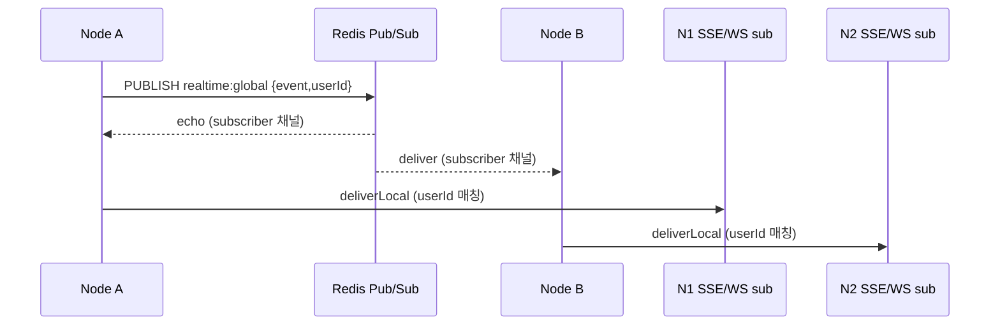

# T-303 — Redis Pub/Sub 버스 (SSE+WS 단일 소스)

> Phase: 3 | Owner: Backend-A | Status: done | Created: 2026-04-28
> Acceptance: 2 노드 시뮬레이션에서 한 노드 publish → 양 노드 SSE/WS 구독자 모두 수신
> Dependencies: [T-302]

## Plan

> 무엇을, 왜, 어떻게.

- 목표: 멀티노드 환경에서 SSE(`/realtime/sse`)와 WS(`/realtime/ws`) 모두 동일한 RealtimeEvent 를 받도록 fan-out 채널을 Redis Pub/Sub 으로 통합.
- 범위:
  - `RealtimeBus` 에 publish hook + deliverLocal 분리
  - `attachRedisFanout(bus, REDIS_URL)` 어댑터 — publisher/subscriber 한 쌍 생성, 단일 채널 `realtime:global`
  - `buildApp()` 에서 `env.REDIS_URL` 있으면 자동 부착, `onClose` 훅으로 정리
  - 단위 테스트 — ioredis 인메모리 모킹 + 멀티노드 시나리오
- 결정/가정:
  - 채널 1개(글로벌) 채택. per-user 채널은 노드 당 구독 수가 무한히 증가하므로 회피.
  - userId 옵션은 wire 페이로드에 포함, `deliverLocal` 단계에서 매칭 → CPU 비용 < 채널 수 폭증 비용.
  - publish 발행 노드도 자기 자신의 echo 를 받음 → 발행자 본인은 hook 에서 `true` 반환해 직접 dispatch 회피, subscriber echo 만으로 dispatch (단일 경로 보장).
  - ioredis 선택: redis 4 client 도 가능하나 ioredis 의 sentinel/cluster 미래 호환성 + lazyConnect 가 부트 안정성에 유리.
- 리스크:
  - Redis 끊김 시 fan-out 정지 (단일 노드는 정상). ioredis 가 자동 재연결 — 손실 메시지는 재시도 안 함 (best-effort fan-out 정책).
  - 채널 폭주 시 head-of-line blocking — 추후 채널 분할 (`realtime:notification` / `realtime:presence` 등) 가능.

## Do

> 구현 변경 사항.

- 추가 파일:
  - `src/modules/realtime/redis-fanout.ts` — `attachRedisFanout()` 어댑터
  - `src/modules/realtime/redis-fanout.test.ts` — 4 케이스 (attach / publish 위임 / 멀티노드 echo / close 정리)
- 수정 파일:
  - `src/modules/realtime/realtime-bus.ts` — `setPublishHook`, `deliverLocal` 추가 (싱글노드 동작 호환)
  - `src/config/env.ts` — `REDIS_URL` zod 스키마 (redis:// or rediss://)
  - `src/app.ts` — REDIS_URL 있으면 fanout 부착, `onClose` 정리
- 추가 의존성: `ioredis@^5.10`
- 핵심 흐름:

## Check

> 검증 결과.

- 단위 테스트:
  - `realtime-bus.test.ts` 4/4 (기존)
  - `realtime.ws.test.ts` 5/5 (기존)
  - `redis-fanout.test.ts` 4/4 (신규: attach / publish 위임 / 멀티노드 echo / close 정리)
- 누계: **18 파일 / 117 테스트 PASS**
- typecheck: PASS
- lint: PASS (49 files, 0 errors)
- 통합 테스트(T-503 testcontainers): pending — 실제 Redis 컨테이너 + 멀티 인스턴스 SSE/WS 통합은 T-503 단계에서 수행.

## Act

> 학습 / 다음 단계.

- 학습한 패턴:
  - **단일 publish 경로 원칙** — Redis 어댑터가 붙으면 발행자 본인도 echo 로 fan-out 받음 → hook 이 직접 dispatch 회피 (중복 방지)
  - publish hook 반환값 컨벤션: `true`=외부 위임 완료, `undefined/false`=폴백 dispatch
  - ioredis `lazyConnect: true` 로 부트 시 즉시 연결 실패 → 첫 connect() 호출 시점에 명시적 처리
- 메모리에 저장:
  - "fan-out 어댑터는 deliverLocal/publish 분리해 단일 dispatch 보장" → 백엔드 메모리 반영
- 후속 태스크에 영향:
  - **T-304** (notifications 모듈): `realtimeBus.publish(notification, { userId })` 한 번 호출 → 멀티노드 fan-out 자동
  - **T-305** (도메인 이벤트 → notification): emit-and-forget 패턴으로 task 어사인 등에서 publish
  - **T-503** (testcontainers): 실제 Redis 인스턴스 띄워 멀티노드 fan-out 검증
- 회고: hook 분리 설계로 SSE/WS 라우트 코드 무변경 + 단일 인스턴스 동작도 그대로 유지. 추후 BullMQ 도 같은 Redis 인스턴스 재사용 가능.
