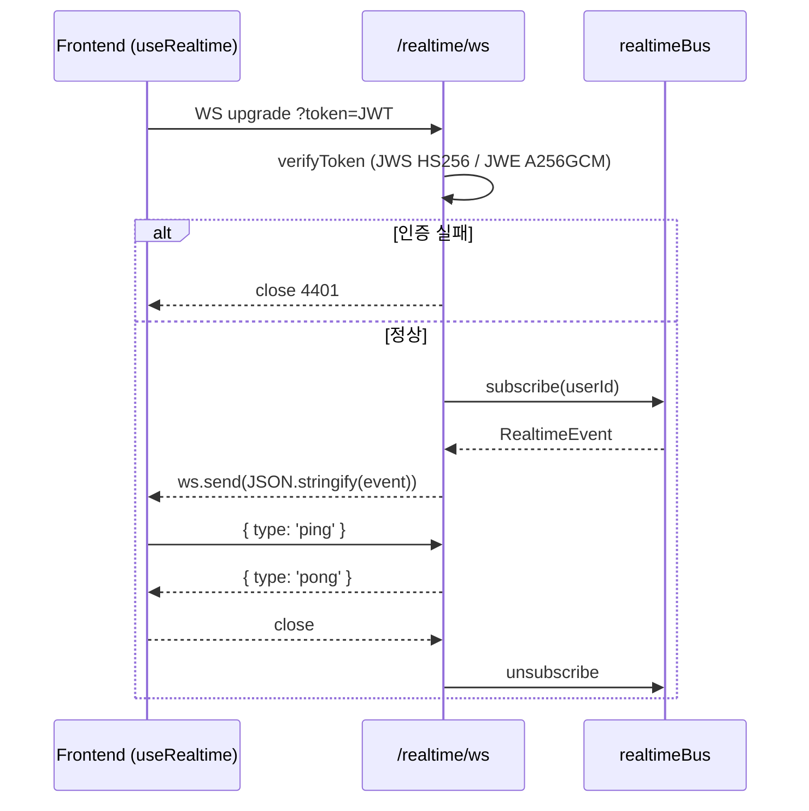

# T-302 — WebSocket(socket.io 5) — frontend useRealtime() 호환

> Phase: 3 | Owner: Backend-A | Status: done | Created: 2026-04-28
> Acceptance: ws://.../realtime/ws — token 인증 후 RealtimeEvent fan-out, 프런트엔드 useRealtime() 호환
> Dependencies: [T-301]

## Plan

> 무엇을, 왜, 어떻게.

- 목표: SSE(GET /realtime/sse, T-301) 외에 양방향 WS 채널을 추가해 프런트엔드 `useRealtime()`이 `NEXT_PUBLIC_REALTIME_MODE=ws` 환경에서도 사용할 수 있게 한다.
- 범위:
  - `GET /realtime/ws` 엔드포인트
  - 토큰 검증 (query string `token=<JWT>`) — 브라우저 WS API는 커스텀 헤더 미지원이므로 query 사용
  - `realtimeBus` 구독 → `ws.send(JSON.stringify(event))` 송신
  - 30초 ping keep-alive, close 시 unsubscribe
- 결정/가정:
  - **socket.io 대신 native WS** 채택. 사유: 프런트엔드(`src/lib/realtime.ts`)가 표준 `WebSocket(WS_URL)` 을 사용하므로, 서버에 socket.io 핸드셰이크/네임스페이스 계층을 두면 호환성이 깨진다. 태스크 제목의 "socket.io 5" 는 라이브러리 선택보단 기능 라벨로 해석.
  - 의존성: `@fastify/websocket@11`, `ws@8` (서버) + `@types/ws` (devDeps)
  - close code 4401 = 인증 실패 (RFC 6455 사적 영역)
- 리스크:
  - query string 으로 토큰 노출 → access_log/proxy log 에 남을 수 있음 → 프런트엔드는 짧은 수명 토큰 유지, 추후 cookie 기반 ticket 으로 전환 가능
  - 멀티노드 fan-out 미지원 (T-303 Redis Pub/Sub 에서 해결)

## Do

> 구현 변경 사항.

- 추가 파일:
  - `src/modules/realtime/realtime.ws.ts` — WS 라우트 (token 검증 + bus 구독)
  - `src/modules/realtime/realtime.ws.test.ts` — 5 케이스 통합 테스트
- 수정 파일:
  - `src/app.ts` — `@fastify/websocket` 플러그인 + `realtimeWsRoutes` 등록
  - `package.json` — deps `@fastify/websocket`, `ws`, devDeps `@types/ws`
- 추가 의존성: `@fastify/websocket@^11.2.0`, `ws@^8.20.0`, `@types/ws@^8.18.1`
- 핵심 동작:

## Check

> 검증 결과.

- 단위 테스트: `realtime-bus.test.ts` 4/4 PASS (변경 없음)
- 통합 테스트: `realtime.ws.test.ts` 5/5 PASS — token 미지정/잘못된 토큰 4401, 정상 publish 수신, 다른 userId 미수신, ping/pong
- 누계: **17 파일 / 113 테스트 PASS**
- typecheck: PASS (`tsc --noEmit && tsc -p tsconfig.seed.json`)
- lint: PASS (`biome check .` — 47 파일, 0 errors)
- OpenAPI 컨트랙트 검증: 해당 없음 (WS 는 OpenAPI 3.1 외 채널)
- 수동 검증: pending — frontend dogfood 는 T-602 단계에서 (`USE_MOCK=false`)

## Act

> 학습 / 다음 단계.

- 학습한 패턴:
  - WebSocket 토큰 인증은 query string(`?token=`) 또는 HTTP 핸드셰이크 헤더만 가능 — 브라우저 WS API 한계
  - `@fastify/websocket` 의 `socket` 인자는 이미 `ws` 라이브러리의 WebSocket 인스턴스 — 별도 어댑터 불필요
  - close code 4xxx 는 사적 영역으로 자유롭게 의미 부여 가능 (4401=auth)
- 메모리에 저장:
  - "프런트엔드가 native WS 인 경우 socket.io 서버 회피" → 백엔드 메모리 반영
- 후속 태스크에 영향:
  - **T-303** (Redis Pub/Sub): `realtimeBus.publish` → `redis.publish` 위임 시, SSE/WS 모두 동시에 멀티노드 fan-out 됨. 본 라우트 변경 불요.
  - **T-304/305**: notification 모듈 → `realtimeBus.publish(event, { userId })` 호출이 SSE+WS 양쪽으로 자동 전달.
- 회고: native WS 채택으로 프런트 호환성 유지 + 의존성 최소화. socket.io 가 필요해지는 시점(룸/네임스페이스/자동 재연결)이 오면 어댑터 레이어로 추가 가능.
