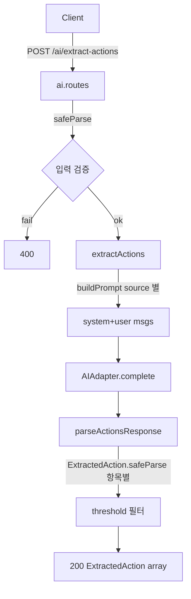

# T-403 — POST /ai/extract-actions (5 source)

> Phase: 4 | Owner: Backend-B | Status: done | Created: 2026-04-28
> Acceptance: ExtractedAction 배열 + confidence ≥ threshold
> Dependencies: [T-401]

## Plan

> 무엇을, 왜, 어떻게.

- 목표: 회의록/이메일/음성 전사/Notion/CSV 5개 소스 텍스트 → ExtractedAction[] 추출 엔드포인트.
- 범위:
  - 핸들러 모듈 `extract-actions.ts` — `buildPrompt`, `parseActionsResponse`, `extractActions(adapter, input)`
  - 라우트 `POST /ai/extract-actions` — Bearer 인증, 입력 검증, default threshold 0.7
  - InMemoryAIAdapter 로 5개 소스 모두 결정론적으로 테스트
- 결정/가정:
  - 응답 envelope 만 검증, 개별 액션은 `ExtractedAction.safeParse` 로 항목별 필터 → 잘못된 1건이 전체를 무효화하지 않음
  - 코드 펜스 (` ```json ... ``` `) 도 strip 후 파싱 — 모델이 marker 를 섞을 수 있음
  - threshold filter 는 호출 측 옵션, default 0.7 (OpenAPI 기본값과 일치)
  - prompt-injection 가드/PII 마스킹 등은 후속 (T-406 에서 prompt versioning 과 함께)
- 리스크:
  - InMemoryAIAdapter 는 정확한 prompt key 매칭이 필요 → 라우트 통합 테스트는 user 메시지 본문을 직접 canned key 로 사용
  - 큰 content (50KB 초과) 는 zod 가 거절 — OpenAPI 명세 외 백엔드 결정

## Do

> 구현 변경 사항.

- 추가 파일:
  - `src/modules/ai/extract-actions.ts` — 핸들러 + buildPrompt + parser
  - `src/modules/ai/extract-actions.test.ts` — 8 케이스
- 수정 파일:
  - `src/modules/ai/ai.routes.ts` — `POST /ai/extract-actions` 라우트
  - `src/modules/ai/ai.routes.test.ts` — 라우트 통합 테스트 2 케이스 추가 (200 + 400)
- 추가 의존성: 없음
- 주요 흐름:



## Check

> 검증 결과.

- 단위 테스트: `extract-actions.test.ts` 8/8 PASS
  - buildPrompt × 5 source
  - parseActionsResponse: 정상 / fenced / 무효 JSON
  - extractActions: default threshold(0.7), threshold=0.5, 무효 액션 필터, 빈 배열
- 통합 테스트: `ai.routes.test.ts` 7/7 PASS (기존 5 + 신규 2)
  - 200 ExtractedAction + 0.4 confidence 항목 제외
  - source enum 위반 → 400
- 누계: **21 파일 / 138 테스트 PASS**
- typecheck: PASS
- lint: PASS (55 files, 0 errors/warnings)
- OpenAPI: `/ai/extract-actions` 컨트랙트 — backend yaml mirror 와 정합. T-601 strict drift 검사로 후속 확인.

## Act

> 학습 / 다음 단계.

- 학습한 패턴:
  - **envelope-then-item 검증**: 외부 envelope 만 검증 후 항목별 safeParse → 부분 무효 응답에 강건
  - 코드 펜스 strip 정규식 — `^```(?:json)?\s*([\s\S]*?)\s*```$` 단일 라인 매칭
  - InMemoryAIAdapter 의 canned key 는 user 메시지 content 와 정확 일치해야 함 → 테스트 시 buildPrompt 호출로 key 생성
- 메모리에 저장:
  - "AI 응답 파싱은 envelope-only 검증 + item-level safeParse" → 백엔드 메모리 반영
- 후속 태스크에 영향:
  - **T-404/405** (reports): 동일 어댑터 + `extract-actions` 와 같은 envelope 패턴 재사용
  - **T-406**: prompt versioning + 토큰/비용 메트릭 — buildPrompt 의 system/user 가 versioning 후크 지점
- 회고: 결정론적 InMemoryAdapter 덕분에 5개 소스 모두 동일 단위 테스트로 회귀 보장. 실제 모델 호출은 T-402 OpenAI 어댑터 구현 시점에 통합 검증.
