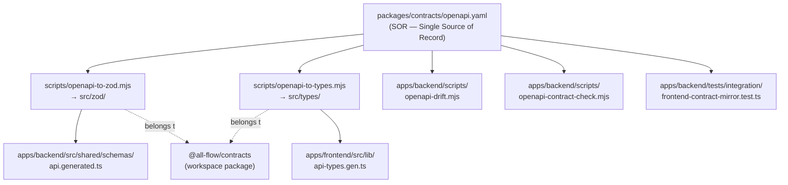

# Design — monorepo-step3-contracts-2026-04-30

> **Generated**: 2026-04-30 by av-do-orchestrator
> **Source Plan**: `docs/01-plan/features/monorepo-step3-contracts-2026-04-30.plan.md`

---

## 1. 컴포넌트 다이어그램



핵심 원칙: **packages/contracts는 SOR + 생성 파이프라인을 캡슐화**한다. consumer 앱(BE/FE)은 generated 산출물만 읽으며, 본 사이클에서는 산출물 위치를 옮기지 않는다(import 경로 변경 0).

---

## 2. packages/contracts 파일 명세

### 2.1 `packages/contracts/package.json`

```json
{
  "name": "@all-flow/contracts",
  "version": "0.1.0",
  "private": true,
  "description": "ALL-Flow OpenAPI 3.1 SOR + generated Zod (BE) and TS types (FE).",
  "type": "module",
  "main": "./dist/index.js",
  "types": "./dist/index.d.ts",
  "exports": {
    ".": { "types": "./dist/index.d.ts", "import": "./dist/index.js" },
    "./openapi.yaml": "./openapi.yaml",
    "./zod": { "types": "./dist/zod/index.d.ts", "import": "./dist/zod/index.js" },
    "./types": { "types": "./dist/types/index.d.ts", "import": "./dist/types/index.js" }
  },
  "files": ["dist", "openapi.yaml", "src"],
  "scripts": {
    "gen:zod": "node scripts/openapi-to-zod.mjs",
    "gen:types": "node scripts/openapi-to-types.mjs",
    "gen": "pnpm gen:zod && pnpm gen:types",
    "build": "pnpm gen && tsup",
    "typecheck": "tsc --noEmit",
    "lint": "echo '(no lint configured for contracts yet)'"
  },
  "devDependencies": {
    "tsup": "^8.3.5",
    "typescript": "^5.7.2",
    "yaml": "^2.8.3"
  },
  "peerDependencies": {
    "zod": "^4.0.0"
  }
}
```

> 주의: `peerDependencies.zod` 만 선언 → BE/FE의 zod 버전 그대로 사용 (catalog 적용 전).
> `dist/zod` / `dist/types` export는 **본 Step에서 generator 산출물이 src/{zod,types}에 자리잡고 build로 dist로 emit된다**는 미래 형태. 본 Step에서는 build를 강제 실행하지 않고 export 키만 정의해 둠 (Step 4 이후 BE/FE consumer 마이그레이션 시 활성화).

### 2.2 `packages/contracts/tsconfig.json`

```json
{
  "compilerOptions": {
    "target": "ES2022",
    "module": "ESNext",
    "moduleResolution": "Bundler",
    "lib": ["ES2022"],
    "strict": true,
    "esModuleInterop": true,
    "skipLibCheck": true,
    "isolatedModules": true,
    "declaration": true,
    "declarationMap": true,
    "outDir": "dist",
    "rootDir": "src",
    "resolveJsonModule": true
  },
  "include": ["src/**/*"],
  "exclude": ["node_modules", "dist", "scripts"]
}
```

### 2.3 `packages/contracts/tsup.config.ts`

```typescript
import { defineConfig } from 'tsup';

export default defineConfig({
  entry: ['src/index.ts', 'src/zod/index.ts', 'src/types/index.ts'],
  outDir: 'dist',
  format: ['esm'],
  target: 'es2022',
  dts: true,
  clean: false,
  splitting: false,
  treeshake: true,
});
```

### 2.4 `packages/contracts/src/index.ts`

```typescript
// Re-export all generated artifacts.
export * from './zod/index.js';
export type * from './types/index.js';
```

### 2.5 `packages/contracts/src/{zod,types}/index.ts`

본 Step에서는 placeholder만 둔다 (generated 폴더는 .gitignore되며 실제 파일은 BE/FE가 자기 폴더에 emit한다).

```typescript
// Placeholder — actual schemas live in apps/backend/src/shared/schemas/api.generated.ts
// for this Step. Future Step will move emit target here.
export {};
```

### 2.6 `packages/contracts/.gitignore`

```
dist/
src/zod/*.generated.*
src/types/*.generated.*
.tsbuildinfo
```

### 2.7 `packages/contracts/README.md`

(짧은 SOR 사용 가이드)

---

## 3. 생성 스크립트 이동

### 3.1 `packages/contracts/scripts/openapi-to-zod.mjs`

기존 `apps/backend/scripts/openapi-to-zod.mjs`에서 **2 라인만 변경**:

| Before (apps/backend/scripts/) | After (packages/contracts/scripts/) |
|---|---|
| `const ROOT = resolve(__dirname, '..');` | `const ROOT = resolve(__dirname, '..');` (== packages/contracts) |
| `const SRC = resolve(ROOT, '..', 'all-flow-frontend', 'openapi.yaml');` | `const SRC = resolve(ROOT, 'openapi.yaml');` |
| `const OUT = resolve(ROOT, 'src', 'shared', 'schemas', 'api.generated.ts');` | `const OUT = resolve(__dirname, '..', '..', '..', 'apps', 'backend', 'src', 'shared', 'schemas', 'api.generated.ts');` |
| banner: `// Source: ../all-flow-frontend/openapi.yaml` | banner: `// Source: packages/contracts/openapi.yaml` |

> Rationale: SRC는 자체 패키지 안. OUT은 **본 Step에서 BE 위치 유지** (consumer 코드 변경 0). Step 4 이후 BE가 `@all-flow/contracts/zod`로 마이그레이션할 때 OUT을 `src/zod/`로 변경.

### 3.2 `packages/contracts/scripts/openapi-to-types.mjs`

```javascript
#!/usr/bin/env node
/**
 * openapi-to-types.mjs — OpenAPI 3.1 → FE TS types via openapi-typescript.
 * 입력:  packages/contracts/openapi.yaml
 * 출력:  apps/frontend/src/lib/api-types.gen.ts (consumer location 유지, Step 3 보수적 codemod)
 */
import { execSync } from 'node:child_process';
import { dirname, resolve } from 'node:path';
import { fileURLToPath } from 'node:url';

const __dirname = dirname(fileURLToPath(import.meta.url));
const ROOT = resolve(__dirname, '..');
const SRC = resolve(ROOT, 'openapi.yaml');
const OUT = resolve(__dirname, '..', '..', '..', 'apps', 'frontend', 'src', 'lib', 'api-types.gen.ts');

execSync(`npx -y openapi-typescript@latest "${SRC}" -o "${OUT}"`, { stdio: 'inherit' });
console.log(`[ok] generated FE types → ${OUT}`);
```

### 3.3 `apps/backend/scripts/openapi-drift.mjs`

기존 파일에서 **1 라인만 변경**:

```diff
- const SRC = resolve(ROOT, '..', 'all-flow-frontend', 'openapi.yaml');
+ const SRC = resolve(ROOT, '..', '..', 'packages', 'contracts', 'openapi.yaml');
```

### 3.4 `apps/backend/scripts/openapi-contract-check.mjs`

```diff
- const SPEC = resolve(ROOT, '..', 'all-flow-frontend', 'openapi.yaml');
+ const SPEC = resolve(ROOT, '..', '..', 'packages', 'contracts', 'openapi.yaml');
```

### 3.5 `apps/backend/tests/integration/frontend-contract-mirror.test.ts`

```diff
- const SPEC = resolve(__dirname, '..', '..', '..', 'frontend', 'openapi.yaml');
+ const SPEC = resolve(__dirname, '..', '..', '..', '..', 'packages', 'contracts', 'openapi.yaml');
```

---

## 4. apps/backend/package.json 변경

```diff
   "dependencies": {
+    "@all-flow/contracts": "workspace:*",
     "@fastify/jwt": "^9.1.0",
     ...
   },
   "scripts": {
     ...
-    "openapi:gen": "node scripts/openapi-to-zod.mjs",
+    "openapi:gen": "pnpm --filter @all-flow/contracts gen:zod",
     "openapi:check": "node scripts/openapi-drift.mjs",
     ...
   }
```

> `openapi:gen`은 contracts 패키지에 위임. drift/contract 스크립트는 BE 위치에 유지 (BE 내부 hash/route 스캔 동작이라 그대로).

## 5. apps/frontend/package.json 변경

```diff
   "dependencies": {
+    "@all-flow/contracts": "workspace:*",
     "@auth/core": "^0.40.0",
     ...
   },
   "scripts": {
     ...
-    "openapi:check": "npx -y @redocly/cli@latest lint openapi.yaml",
-    "openapi:gen": "npx -y openapi-typescript@latest openapi.yaml -o src/lib/api-types.gen.ts",
+    "openapi:check": "npx -y @redocly/cli@latest lint ../../packages/contracts/openapi.yaml",
+    "openapi:gen": "pnpm --filter @all-flow/contracts gen:types",
     ...
   }
```

---

## 6. pnpm-workspace.yaml 변경

```diff
 packages:
   - 'apps/backend'
   - 'apps/frontend'
-  # - 'packages/*'   # Step 3+ (contracts, shared, config-*)
+  - 'packages/*'    # Step 3+ (contracts, shared, config-*)
```

---

## 7. 주석 codemod (소스 변경 무시)

다음 BE 파일의 주석/문자열에서 `frontend openapi.yaml` → `@all-flow/contracts (packages/contracts/openapi.yaml)`:

- apps/backend/src/modules/issues/issues.routes.ts
- apps/backend/src/modules/reports/reports.routes.ts
- apps/backend/src/modules/projects/projects.routes.ts
- apps/backend/src/modules/tasks/tasks.routes.ts
- apps/backend/src/modules/identity/identity.routes.ts
- apps/backend/src/shared/schemas/api.generated.ts (banner)
- apps/backend/src/shared/schemas/index.ts (header)

이 변경은 모두 **주석/문자열 only** — 컴파일 결과 0 영향.

---

## 8. 검증 시나리오 (Do 후 실행)

```bash
# G1
ls /data/allflow/packages/contracts/{package.json,openapi.yaml,tsconfig.json,tsup.config.ts}

# G2
cd /data/allflow && pnpm install --no-frozen-lockfile

# G3 — Zod regenerate must be byte-equivalent
cd /data/allflow && pnpm --filter @all-flow/backend openapi:gen
git diff apps/backend/src/shared/schemas/api.generated.ts        # expected: 1-line banner change only
git diff apps/backend/src/shared/schemas/.openapi.hash           # expected: hash unchanged

# G4
pnpm --filter @all-flow/backend openapi:check                     # exit 0

# G5
pnpm --filter @all-flow/backend typecheck
pnpm --filter @all-flow/backend test
pnpm --filter @all-flow/backend test:int

# G6
pnpm --filter all-flow typecheck
pnpm --filter all-flow test

# G7
pnpm --filter @all-flow/backend openapi:contract:strict           # exit 0

# G8 (선택, time-permitting)
pnpm --filter all-flow e2e

# G9
git diff apps/backend/prisma/                                     # 0 lines
```

---

## 9. 롤백 계획

전체 변경은 단일 commit에 포함. 회귀 발견 시:

```bash
git reset --hard HEAD^   # Step 3 commit 직전으로 복귀
cd apps/infra && make down ENV=dev || true
```

---

**End of Design**
