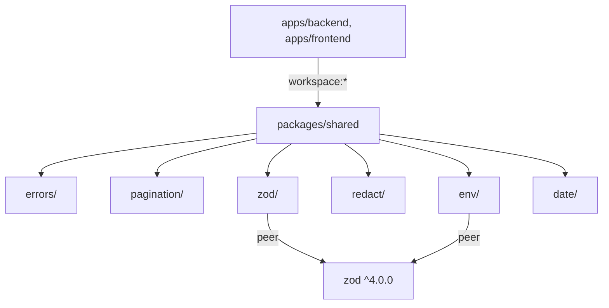

# Design — monorepo-step4-shared-2026-04-30

> **Generated**: 2026-04-30 by av-do-orchestrator (PL)
> **Source Plan**: `docs/01-plan/features/monorepo-step4-shared-2026-04-30.plan.md`

---

## 1. 모듈 그래프



---

## 2. 공개 API 표면

### 2.1 errors

```ts
// @all-flow/shared/errors
export interface ErrorResponse {
  error: { code: string; message: string; details?: unknown; traceId: string };
}

export class AppError extends Error {
  readonly code: string;
  readonly statusCode: number;
  readonly details?: unknown;
  constructor(p: { code: string; message: string; statusCode: number; details?: unknown });
}

export class AuthError extends AppError {}        // 401 AUTH_REQUIRED
export class ForbiddenError extends AppError {}   // 403 FORBIDDEN
export class NotFoundError extends AppError {}    // 404 NOT_FOUND
export class ConflictError extends AppError {}    // 409 CONFLICT
export class ValidationError extends AppError {}  // 400 VALIDATION_FAILED
export class RateLimitError extends AppError {}   // 429 RATE_LIMITED  (NEW vs BE 원본)

export function isAppError(e: unknown): e is AppError;
export function toErrorResponse(e: AppError, traceId: string): ErrorResponse;
```

> **NEW vs BE 원본**: `RateLimitError` 추가 (BE plugin/rate-limit.ts 에서 raw `reply.code(429).send(...)` 사용 중인 케이스 일관화).

### 2.2 pagination

```ts
// @all-flow/shared/pagination
export interface CursorPageInput {
  cursor?: string;
  limit?: number;     // default 20, max 100
}
export interface CursorPage<T> {
  items: readonly T[];
  nextCursor: string | null;
  hasMore: boolean;
}

export interface OffsetPageInput {
  page?: number;      // 1-indexed
  pageSize?: number;  // default 20, max 100
}
export interface OffsetPage<T> {
  items: readonly T[];
  total: number;
  page: number;
  pageSize: number;
  hasMore: boolean;
}

export function clampLimit(n: number | undefined, max?: number): number;
```

### 2.3 env

```ts
// @all-flow/shared/env
import type { ZodType } from 'zod';

export interface EnvSource {
  readonly [key: string]: string | undefined;
}

export class EnvValidationError extends Error {
  readonly issues: readonly string[];
  constructor(message: string, issues: readonly string[]);
}

/**
 * source 객체에서 key의 값을 읽어 schema로 검증한다.
 * 직접 process.env 접근하지 않으며, Node.js·Browser 양쪽에서 안전하다.
 */
export function getEnvVar<T>(source: EnvSource, key: string, schema: ZodType<T>): T;

/**
 * 다수 변수를 한 번에 검증.
 */
export function loadEnvFrom<TShape extends Record<string, ZodType>>(
  source: EnvSource,
  shape: TShape,
): { [K in keyof TShape]: TShape[K] extends ZodType<infer U> ? U : never };
```

### 2.4 redact

```ts
// @all-flow/shared/redact
export interface RedactOptions {
  keys?: readonly string[];           // default: DEFAULT_REDACT_KEYS
  placeholder?: string;               // default: '[REDACTED]'
  maxDepth?: number;                  // default: 6
}

export const DEFAULT_REDACT_KEYS: readonly string[];
// = ['password','token','authorization','apikey','api_key','secret','cookie','set-cookie',
//    'access_token','refresh_token','client_secret']

export function redactSecrets(value: unknown, options?: RedactOptions): unknown;
```

알고리즘:
- 깊이 우선, 객체 키 lower-case 비교
- 배열은 그대로 순회
- 순환 참조 보호 (`WeakSet`)
- 비-객체(string/number/bool/null/undefined)는 그대로 반환
- maxDepth 초과 시 `'[REDACTED:DEPTH]'` 반환

### 2.5 zod

```ts
// @all-flow/shared/zod
import type { ZodType } from 'zod';
import { ValidationError } from '../errors';

export function parseOrThrow<T>(schema: ZodType<T>, value: unknown, where?: string): T;
export function safeParseOr<T>(schema: ZodType<T>, value: unknown, fallback: T): T;
```

### 2.6 date

```ts
// @all-flow/shared/date
export function toIsoString(d: Date | number | string): string;
export function isIsoString(s: string): boolean;
export function parseIso(s: string): Date | null;
```

규칙:
- `toIsoString`: `Date` → `Date.toISOString()`, `number` → `new Date(n).toISOString()`, `string` → 검증 후 정규화
- `isIsoString`: regex 검증 + `Date.parse` not NaN
- `parseIso`: 실패 시 `null` (예외 던지지 않음)

---

## 3. 디렉토리 트리 (확정)

```
packages/shared/
├── package.json
├── tsconfig.json
├── tsup.config.ts
├── README.md
├── src/
│   ├── index.ts                       # re-export 7 sub-barrel
│   ├── errors/
│   │   ├── index.ts
│   │   ├── app-error.ts
│   │   └── http-errors.ts
│   ├── pagination/
│   │   ├── index.ts
│   │   ├── cursor.ts
│   │   └── offset.ts
│   ├── env/
│   │   ├── index.ts
│   │   └── safe-getter.ts
│   ├── redact/
│   │   ├── index.ts
│   │   └── deep-redact.ts
│   ├── zod/
│   │   ├── index.ts
│   │   └── helpers.ts
│   └── date/
│       ├── index.ts
│       └── iso.ts
└── tests/
    ├── errors.test.ts
    ├── pagination.test.ts
    ├── env.test.ts
    ├── redact.test.ts
    ├── zod.test.ts
    └── date.test.ts
```

각 서브모듈 ≤ 100 LOC, 합계 ≈ 600~700 LOC, 모든 파일 < 500 LOC.

---

## 4. 의존성 정책

| Dep | 위치 | 사유 |
|-----|------|------|
| `zod` | peerDependencies | BE/FE 가 자체 zod 가짐. duplicate 방지 |
| `tsup` | devDependencies | build only |
| `typescript` | devDependencies | typecheck only |
| `vitest` | devDependencies | test only |

런타임 의존성: **0개**. (zod는 peer)

---

## 5. dogfood 변경 (1~2 호출처)

### 5.1 BE — `apps/backend/src/shared/errors.ts`

```ts
// 변경 후 (re-export shim)
export {
  AppError,
  AuthError,
  ForbiddenError,
  NotFoundError,
  ConflictError,
  ValidationError,
  RateLimitError,
  type ErrorResponse,
} from '@all-flow/shared/errors';
```

기존 import: `import { AuthError } from '../shared/errors'` → **변경 0**

### 5.2 FE — `apps/frontend/src/lib/api-error.ts`

```ts
import type { ErrorResponse } from '@all-flow/shared/errors';
// (기존 ApiError, toApiError 함수는 그대로)

// 추가: BE envelope을 인식하기 위한 타입 가드
export function isErrorResponseEnvelope(v: unknown): v is ErrorResponse {
  return typeof v === 'object' && v !== null && 'error' in v
    && typeof (v as any).error === 'object';
}
```

기존 사용처 (`toApiError`, `toastMessage`) → **변경 0**.

---

## 6. 테스트 매트릭스

| 모듈 | 케이스 |
|------|--------|
| errors | 6개 클래스 instanceof + statusCode + code |
| pagination | clampLimit boundary (undefined/0/-1/101/100) |
| env | 정상/누락/잘못된 값 + EnvValidationError |
| redact | 단순 키 / 중첩 / 배열 / 순환 / maxDepth / 대소문자 무관 |
| zod | parseOrThrow throws ValidationError / safeParseOr fallback |
| date | toIsoString 3 input shape / isIsoString true/false / parseIso null |

목표: shared 단독 vitest ≥ 30 cases PASS.

---

## 7. 빌드 검증

```bash
pnpm --filter @all-flow/shared build
pnpm --filter @all-flow/shared typecheck
pnpm --filter @all-flow/shared test

# tree-shake 검증
ls -la packages/shared/dist
# 7 entry chunks + 7 .d.ts + 0 cjs

# isomorphic 가드
grep -RnE "from 'node:|require\\('fs|window|document|@prisma|fastify|next/" packages/shared/src
# 0 hit 절대 조건
```

---

## 8. CI/Turbo 통합

`turbo.json` 변경 없음 (이미 `build/test/typecheck/lint` 4 task가 모든 workspace 적용).

`turbo run build --filter=@all-flow/shared` → 단독 빌드 PASS.
`turbo run build --filter=@all-flow/backend^...` → backend가 shared 의존시 cascade 빌드.

---

## 9. 트레이드오프 기록

| 결정 | 채택 | 대안 | 사유 |
|------|------|------|------|
| zod peerDependency | ✅ | dependency | BE/FE 자체 zod 사용 + 메이저 충돌 방지 |
| ESM only | ✅ | ESM+CJS | BE Fastify 5 / FE Next 16 모두 ESM. CJS 불필요 |
| sub-barrel export | ✅ | 단일 barrel | 사용처가 `/errors`, `/pagination` 단위로 import → tree-shake 친화 |
| RateLimitError 추가 | ✅ | BE 원본 그대로 | rate-limit.ts 일관화 사전 준비 |
| ID 생성기 미포함 | ✅ | ulid 포함 | crypto.randomUUID 합의 미정 → 다음 사이클 |

---

**End of Design** — 다음 액션: S4.2 스켈레톤 생성 + S4.3 구현
