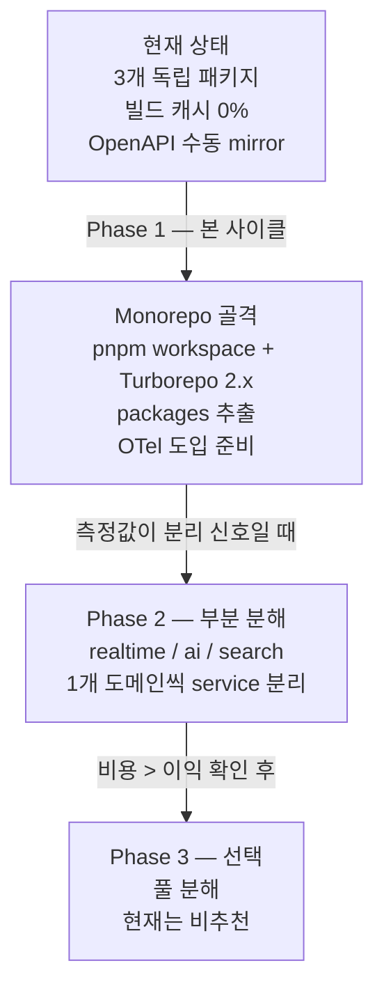
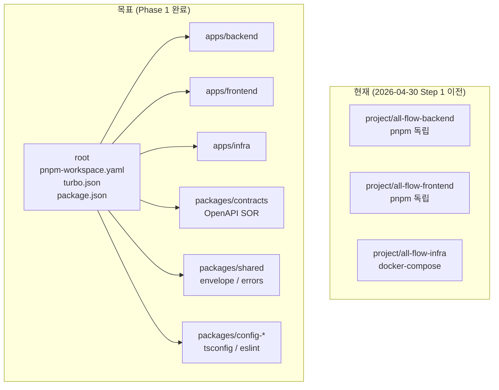

# 00. 개요 — 왜 이 아키텍처인가

> 학습 목표: all-flow 프로젝트가 "지금 이 구조"를 선택한 이유를 업계 트렌드와 실제 사례 기반으로 설명할 수 있다.

---

## 1. 문제 정의 — 무엇이 불편했는가

2026-04-30 기준 all-flow 프로젝트는 3개 패키지가 완전히 독립적으로 운영되었다.

```
project/all-flow-backend/   ← 자체 pnpm + package.json
project/all-flow-frontend/  ← 자체 pnpm + package.json
project/all-flow-infra/     ← docker-compose (package.json 없음)
```

이 구조에서 발생한 실제 비용:

| 문제 | 현재 비용 |
|------|----------|
| OpenAPI 수동 mirror | FE `openapi.yaml` 1162줄 ↔ BE Zod 수동 동기화. 변경 시 두 곳 수정 필요 |
| 빌드 캐시 0% | CI에서 BE + FE 매번 전체 빌드. 문서 1줄 변경도 6분 소요 |
| 의존성 버전 드리프트 | `zod ^4.3.6`(BE) vs `^4.1.0`(FE) — 메이저 충돌 시 디버깅 비용 발생 |
| 신규 개발자 온보딩 | 3개 폴더 각각 `pnpm i`, .env 3개 복사, 실행 순서 가이드 부재 (8단계 필요) |

---

## 2. "MSA로 당장 분리하면 안 되나?" — 업계 트렌드

### 2.1 CNCF 2026 Q1 보고서

2026년 1분기, CNCF(Cloud Native Computing Foundation)는 흥미로운 데이터를 발표했다.

> **42%의 조직이 MSA에서 다시 Modular Monolith로 회귀했다.**

왜 회귀했는가?

- 로컬 개발 환경 붕괴: 20개 서비스를 띄우려면 노트북 메모리 32GB도 부족
- 분산 트랜잭션 복잡도: 단일 Prisma 트랜잭션 → SAGA/Outbox 패턴 강제
- 인프라 비용 10배 증가: 서비스당 컨테이너 + DB 연결 풀 + 네트워킹

### 2.2 Amazon Prime Video 사례 (2023~2026)

Amazon Prime Video 팀이 MSA에서 Modular Monolith로 전환 후 **인프라 비용 90% 감소**를 달성했다.
이 사례는 "MSA = 더 좋음"이 아니라 "측정값이 분리를 정당화할 때만 분리"임을 보여준다.

> "Architecture should follow maturity, not fashion." — 2026 업계 컨센서스

### 2.3 all-flow에 적용

all-flow-backend는 현재 20개 모듈로 구성된 Modular Monolith다.
이 상태에서 즉시 분리하면:

- 현재 `http://localhost` 단일 포트로 가동되는 dev 환경이 붕괴
- 공유 Prisma 트랜잭션 → 분산 트랜잭션으로 교체 필요 (수 주 작업)
- 20개 컨테이너 + service mesh → 로컬 dev 무결성 파괴

---

## 3. 그럼 무엇을 하는가 — 3단계 진화



**핵심 원칙**: 지금은 "필요할 때 쪼갤 수 있는 구조"를 만든다.
측정 데이터(OTel) 없이 분리하는 것은 금지다.

---

## 4. 현재 상태 vs 목표 상태 (Phase 1 완료 시)



Phase 1 완료 시 달성 목표:

| 지표 | 현재 | 목표 |
|------|------|------|
| 전체 설치 | `pnpm i` 3회 | `pnpm i` 1회 |
| dev 시작 | 8단계 | `pnpm dev` 1회 |
| OpenAPI 변경 반영 시간 | ~10분 (수동) | < 2분 (자동 gen) |
| 빌드 캐시 hit | 0% | ≥ 80% |
| CI 시간 (warm cache) | ~6분 | ≤ 90초 |

---

## 5. 왜 pnpm + Turborepo인가

| 비교축 | Turborepo 2.x | Nx | Moon |
|--------|--------------|-----|------|
| 학습 곡선 | 낮음 (`turbo.json` 단일) | 높음 (plugins) | 중간 |
| Watch mode | 2.0+ 내장 | 내장 | 내장 |
| 설정 복잡도 | 최소 | 높음 | 중간 |
| 기존 pnpm 워크플로우 | 그대로 유지 | 강하게 통합 | 그대로 |

all-flow는 현재 3개 앱 + 최대 6개 패키지 규모다.
Nx의 generator/plugin 생태계 가치는 이 규모에서 ROI가 낮다.
Turborepo의 cache hit + watch mode면 충분하다.

pnpm을 선택한 이유:

- workspace 60~80% disk 감소 (심볼릭 링크 기반 hoisting)
- 3~5배 빠른 install (content-addressable store)
- Catalog 기능 — 공통 의존성 버전을 한 곳에서 관리

---

## 체크포인트

1. CNCF 2026 Q1 보고서에서 42%의 조직이 MSA에서 Modular Monolith로 회귀한 이유 3가지를 설명하라.

   **답**: 로컬 개발 환경 붕괴(20개 서비스 메모리 부담), 분산 트랜잭션 복잡도(SAGA/Outbox 강제), 인프라 비용 증가(서비스당 컨테이너 + DB 풀 + 네트워킹).

2. Amazon Prime Video 사례에서 배울 수 있는 아키텍처 원칙은 무엇인가?

   **답**: "Architecture should follow maturity, not fashion." — 측정값이 분리를 정당화할 때만 분리해야 한다. MSA가 무조건 좋은 것이 아니라 규모와 비용에 따라 Modular Monolith가 더 나을 수 있다.

3. all-flow Phase 1에서 "분리"를 하지 않는 직접적인 이유 2가지는?

   **답**: (1) OpenTelemetry 측정 데이터가 없어 분리 신호 자체가 불분명하다. (2) 현재 single-port localhost dev 환경이 분리 시 붕괴된다 (20개 컨테이너 + service mesh 필요).
