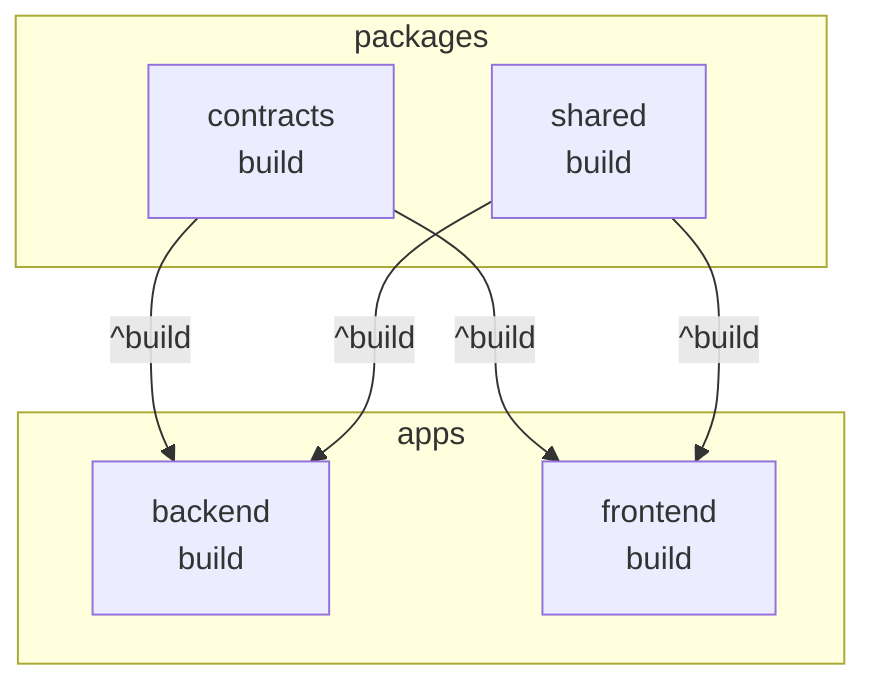
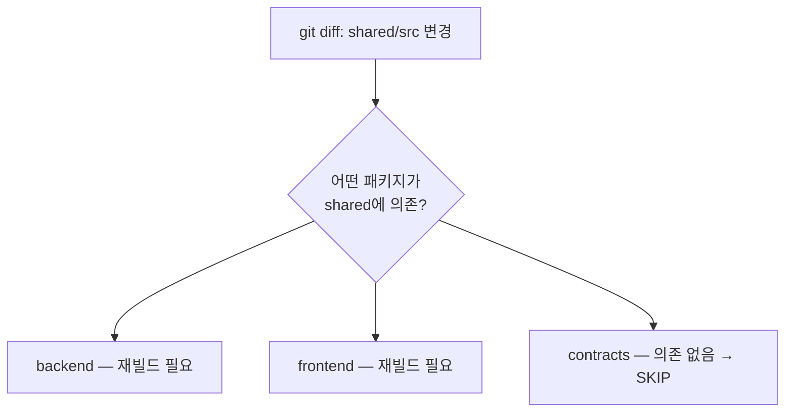

# 03. Turborepo 2.x — Task Graph와 Cache

> 학습 목표: Turborepo의 task graph와 cache가 왜 빌드 시간을 단축하는지 설명하고, `--affected` 옵션을 언제 사용하는지 판단할 수 있다.

---

## 1. 문제 정의 — 빌드 캐시 없는 CI의 비용

all-flow에서 CI가 매번 전체 빌드를 실행하면:

```
docs/README.md만 변경한 PR 오픈
  → BE 전체 빌드 (~2분)
  → FE 전체 빌드 (~4분)
  → 총 6분 대기
  → 리뷰 속도 저하
```

문서 1줄 수정이 6분짜리 빌드를 트리거한다.
Turborepo는 이 문제를 "무엇이 실제로 변경되었는가"를 추적하여 해결한다.

---

## 2. Turborepo가 하는 일

Turborepo는 task runner다. `pnpm build`를 실행할 때 어떤 패키지를 어떤 순서로 빌드할지,
그리고 이전과 입력이 동일하면 cache를 사용할지를 결정한다.

핵심 기능 3가지:
1. **Task Graph** — 패키지 간 의존성을 파악하여 올바른 순서로 실행
2. **Cache** — 입력(소스 파일, 환경변수)이 같으면 이전 출력을 재사용
3. **--affected** — 변경된 패키지와 그에 의존하는 패키지만 실행

---

## 3. 실제 all-flow turbo.json 분석

현재 `/data/allflow/turbo.json` 내용:

```json
{
  "$schema": "https://turborepo.com/schema.json",
  "ui": "tui",
  "globalDependencies": [
    "tsconfig.base.json",
    ".env*"
  ],
  "tasks": {
    "build": {
      "dependsOn": ["^build"],
      "outputs": ["dist/**", ".next/**", "!.next/cache/**"],
      "inputs": ["src/**", "tsconfig*.json", "package.json"]
    },
    "test": {
      "dependsOn": ["^build"],
      "outputs": ["coverage/**"],
      "inputs": ["src/**", "tests/**", "vitest.config.*", "package.json"]
    },
    "lint": {
      "outputs": [],
      "inputs": ["src/**", "biome.json", "eslint.config.*", "package.json"]
    },
    "typecheck": {
      "dependsOn": ["^build"],
      "outputs": [],
      "inputs": ["src/**", "tsconfig*.json", "package.json"]
    },
    "dev": {
      "cache": false,
      "persistent": true
    },
    "clean": {
      "cache": false
    }
  }
}
```

각 필드 설명:

| 필드 | 의미 |
|------|------|
| `dependsOn: ["^build"]` | 이 패키지 빌드 전에 의존 패키지의 `build`를 먼저 실행 |
| `outputs` | cache로 저장할 파일 경로 |
| `inputs` | 이 파일들이 변경될 때만 재실행 |
| `cache: false` | 항상 실행 (dev 서버 같은 장기 실행 프로세스에 적합) |
| `persistent: true` | 종료되지 않는 task 명시 (dev 서버, watch 모드) |

---

## 4. Task Graph 시각화

`"dependsOn": ["^build"]`의 `^`는 "의존 패키지의 build를 먼저"를 의미한다.



이 graph가 없으면 `backend`가 `contracts`보다 먼저 빌드되어 타입 오류가 발생한다.
Turborepo는 이 의존 관계를 자동으로 파악하여 올바른 순서를 보장한다.

---

## 5. Cache 동작 원리

Turborepo는 다음을 해시하여 cache key를 생성한다:
- `inputs`에 정의된 파일들의 내용 해시
- `globalDependencies`의 내용 해시 (`tsconfig.base.json`, `.env*`)
- 실행 환경 정보

```
turbo run build 실행
  → cache key 계산: hash(src/**, tsconfig*.json, package.json, tsconfig.base.json)
  → cache hit?
    YES → dist/ 재사용 (0초)
    NO  → 실제 빌드 실행 → 결과를 cache에 저장
```

### Before/After 비교

```
# Before (Turborepo 없음)
$ pnpm build
frontend: 4분 00초
backend:  2분 00초
총: 6분 00초 (매번)

# After (Turborepo + warm cache)
$ turbo run build
contracts: [CACHED] 0.1초
shared:    [CACHED] 0.1초
backend:   [CACHED] 0.1초
frontend:  [CACHED] 0.1초
총: 0.4초
```

`!.next/cache/**`는 Next.js의 자체 빌드 캐시를 turbo cache 대상에서 제외한다.
두 캐시 시스템이 충돌하지 않도록 하는 설정이다.

---

## 6. `--affected` 옵션

변경된 패키지와 그 의존 패키지만 실행한다.

```bash
# git diff를 기반으로 변경 감지
turbo run build --affected

# 기준 브랜치 명시
turbo run build --affected --filter="...[origin/main]"
```



CI에서 `--affected`를 사용하면:
- docs만 변경 → 빌드 0건 실행
- `shared` 변경 → `shared` + 의존 패키지만 재빌드
- `contracts` 변경 → `contracts` + `backend` + `frontend` 재빌드

---

## 7. `dev` task는 cache하지 않는다

```json
"dev": {
  "cache": false,
  "persistent": true
}
```

`dev` 서버는 파일을 감시하며 계속 실행되는 프로세스다.
cache와 맞지 않는 개념이므로 `cache: false`로 설정한다.
`persistent: true`는 Turborepo에게 "이 task는 종료되지 않는다"를 알려
다른 task의 완료를 기다리지 않도록 한다.

---

## 체크포인트

1. `"dependsOn": ["^build"]`에서 `^` 기호의 의미는 무엇인가?

   **답**: `^`는 "이 패키지가 의존하는 다른 패키지들의 `build` task가 먼저 완료되어야 한다"는 의미다. `^` 없이 `["build"]`이면 같은 패키지의 `build`를 먼저 실행한다는 의미다.

2. `"cache": false`를 `dev` task에 설정해야 하는 이유는?

   **답**: `dev` 서버는 파일 변경을 감시하며 계속 실행되는 프로세스다. 실행 결과물이 고정되지 않으므로 cache 개념이 적용되지 않는다. cache를 사용하면 이전 실행 결과로 대체될 수 있어 실시간 반영이 안 된다.

3. CI에서 `turbo run build --affected`를 사용하면 "docs/README.md만 변경한 PR"에서 빌드가 몇 번 실행되는가?

   **답**: 0번이다. `--affected`는 변경된 패키지와 그 의존 패키지만 실행한다. `docs/README.md`는 어떤 패키지의 `inputs`에도 포함되지 않으므로 빌드 대상이 없다. (단, `docs`가 별도 패키지이고 다른 패키지가 의존한다면 달라진다.)
