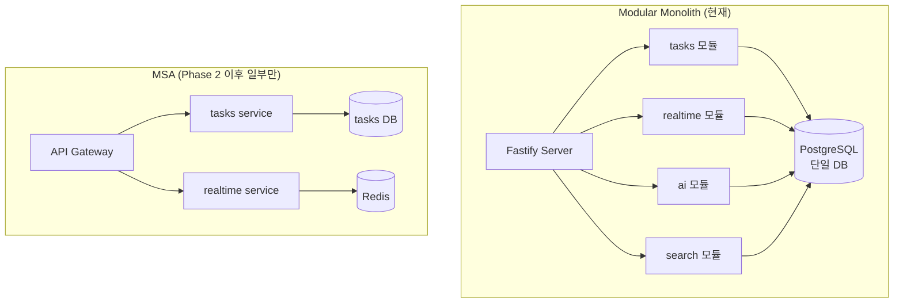

# 01. Modular Monolith — 왜 Phase 1은 분리하지 않는가

> 학습 목표: Modular Monolith와 MSA의 트레이드오프를 데이터 기반으로 설명하고, all-flow가 현 단계에서 분리하지 않는 이유를 근거 있게 설명할 수 있다.

---

## 1. 문제 정의 — "왜 MSA로 바로 가지 않는가?"

신입 개발자가 가장 자주 묻는 질문이다.
"마이크로서비스가 더 현대적이고 확장 가능하지 않나요?"

이 질문에 답하기 위해 먼저 비용을 계산해야 한다.

---

## 2. MSA의 실제 비용

### 2.1 로컬 개발 환경 붕괴

all-flow-backend를 20개 서비스로 분리한다고 가정하면:

```
로컬 dev 실행에 필요한 것:
- 20개 서비스 컨테이너
- 20개 서비스 각각의 포트
- service mesh (Istio/Linkerd) — 서비스 간 통신 라우팅
- API Gateway — 외부 트래픽 라우팅
- 분산 트레이싱 (OTel collector)
- 서비스 디스커버리 (Consul/k8s 서비스)

현재: docker-compose up → http://localhost 1개
MSA: 최소 노트북 메모리 32GB, 부팅 시간 5분+
```

현재 all-flow의 가치 명제: **"개발자 한 명이 로컬에서 전체 스택을 1줄로 가동"**
MSA는 이 가치를 파괴한다.

### 2.2 분산 트랜잭션 복잡도

현재 Prisma 단일 트랜잭션 패턴:

```typescript
// 현재 (단일 DB 트랜잭션 — all-flow-backend)
await prisma.$transaction([
  prisma.task.create({ data: taskData }),
  prisma.event.create({ data: eventData }),
  prisma.notification.create({ data: notifData }),
]);
```

MSA 분리 후 필요한 패턴:

```typescript
// SAGA 패턴 (분산 트랜잭션) — 수 주 구현 필요
// 1. Task 서비스에 create 요청
// 2. 성공 시 Event 서비스에 create 요청
// 3. 성공 시 Notification 서비스에 create 요청
// 4. 어느 단계에서 실패하면 보상 트랜잭션(compensating tx) 실행
// → Saga Orchestrator 또는 Choreography 구현 필요
```

### 2.3 인프라 비용 증가

Amazon Prime Video 팀의 실제 데이터:

> MSA에서 Modular Monolith로 전환 후 **인프라 비용 90% 감소**

서비스당 필요한 비용:
- 컨테이너 실행 비용 (최소 0.5 vCPU + 512MB RAM)
- Load Balancer
- DB 연결 풀 (PgBouncer 또는 RDS Proxy)
- 서비스 간 네트워크 I/O 비용
- 분산 트레이싱 수집 비용

20개 서비스 = 이 모든 것 × 20

---

## 3. CNCF 2026 Q1 트렌드

2026년 1분기 CNCF 보고서의 핵심 수치:

> **42%의 조직이 MSA → Modular Monolith로 회귀**

이 조직들이 공통으로 꼽은 회귀 이유:
1. 서비스 분해 후 개발 속도 저하 (코드 변경 → n개 PR → n개 배포 파이프라인)
2. 운영 복잡도 폭발 (n개 서비스 × m개 인스턴스 모니터링)
3. 서비스 간 계약 관리 비용 (API 버전 관리, 하위 호환성)

결론:
> "Architecture should follow maturity, not fashion."
> 아키텍처는 유행이 아니라 팀/시스템의 성숙도를 따라야 한다.

---

## 4. all-flow-backend 20개 모듈 구조

현재 `/data/allflow/project/all-flow-backend/src/modules/` 폴더 목록:

```
ai/          — AI 액션 추출, LLM 어댑터
approvals/   — 승인 워크플로우
auth/        — 인증 (JWT 검증)
channels/    — 채널 관리
clients/     — 클라이언트 관리
comments/    — 댓글
docs/        — 문서 관리
events/      — 이벤트 로그
health/      — 헬스체크
identity/    — 사용자 정체성
issues/      — 이슈 추적
notifications/ — 알림
org/         — 조직 관리
projects/    — 프로젝트 관리
realtime/    — WebSocket + Redis fan-out
reports/     — 보고서
resources/   — 리소스 관리
search/      — 전문 검색 (pgvector)
tasks/       — 태스크 관리
```

이 20개 모듈은 현재 **하나의 Fastify 서버 프로세스**로 실행된다.
모듈 간 통신은 직접 함수 호출 (HTTP 요청 오버헤드 없음, 타입 안전).

---

## 5. Modular Monolith vs MSA 비교



---

## 6. "지금 분리하면 안 되는 이유" 요약

| 이유 | 근거 |
|------|------|
| 측정 데이터 없음 | OTel 미도입 → 어느 모듈이 병목인지 모름 |
| dev 환경 파괴 | single-port localhost → 20개 컨테이너 |
| 트랜잭션 재설계 필요 | Prisma 단일 tx → SAGA 패턴 (수 주 작업) |
| 인프라 비용 증가 | 현재 1개 컨테이너 → 20개 × 리소스 |
| CNCF 2026 트렌드 반대 | 42% 회귀 — 성숙도 없는 분리는 역행 |

Phase 1의 목표는 **"분리할 수 있는 골격"**을 만드는 것이지 지금 분리하는 것이 아니다.
골격이 준비되고, OTel로 측정하고, 분리 신호가 오면 그때 1개 모듈을 떼낸다.

---

## 체크포인트

1. all-flow-backend를 20개 MSA로 즉시 분리했을 때 로컬 dev 환경에서 발생하는 구체적 문제 2가지를 설명하라.

   **답**: (1) 20개 컨테이너 + service mesh + API Gateway를 로컬에서 실행해야 하므로 메모리 32GB+가 필요하고 부팅 시간이 5분+이 된다. (2) 현재 single-port localhost(http://localhost 1개)로 가동되던 dev 환경이 붕괴된다.

2. Prisma 단일 트랜잭션을 MSA 분리 후 대체해야 하는 패턴 이름과 그 복잡도를 설명하라.

   **답**: SAGA 패턴(보상 트랜잭션 포함)으로 대체해야 한다. 단계별 성공/실패를 추적하고, 실패 시 이전 단계를 보상하는 로직을 별도로 구현해야 한다. Orchestration 또는 Choreography 방식으로 구현하며, 구현 비용이 수 주에 달한다.

3. CNCF 2026 Q1 데이터에서 42%의 조직이 MSA에서 회귀한 것이 all-flow에 주는 시사점은?

   **답**: "MSA가 더 현대적"이라는 유행에 따르는 것이 아니라, 팀 규모·측정 데이터·운영 성숙도를 기반으로 아키텍처를 선택해야 한다. 현재 all-flow는 단일 개발자 + OTel 미도입 상태이므로 Modular Monolith를 유지하는 것이 2026 업계 컨센서스와 일치한다.
