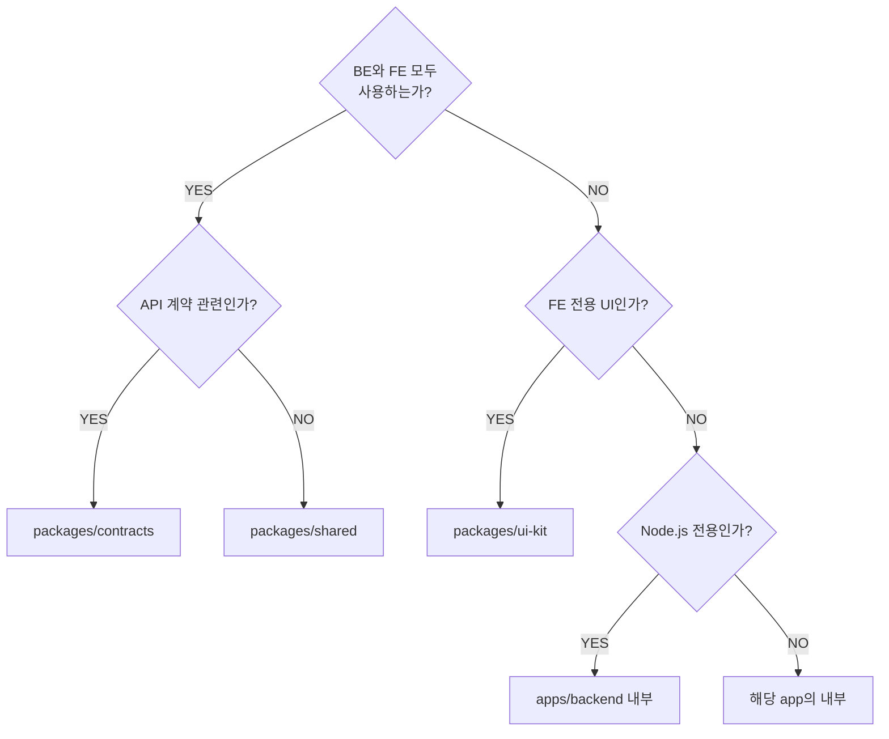

# 02. Package Boundaries — 무엇을 어디에 두는가

> 학습 목표: contracts / shared / config / ui-kit 각 패키지의 역할과 경계를 설명하고, 새 코드를 어느 패키지에 추가할지 판단할 수 있다.

---

## 1. 문제 정의 — 코드 중복의 비용

monorepo를 구성했어도 패키지 경계가 없으면 코드 중복이 발생한다.

all-flow에서 현재 중복되는 코드:

```
BE (src/shared/schemas/):
  interface RealtimeEvent { type: string; payload: unknown }
  function createEnvelope(data, meta) { ... }

FE (src/lib/api-types.gen.ts):
  interface RealtimeEvent { type: string; payload: unknown }  // 동일 정의!
  function wrapResponse(data) { ... }                          // 유사 로직
```

변경이 필요할 때 두 곳을 수정해야 하고, 놓치면 런타임 불일치가 발생한다.

---

## 2. 4개 공유 패키지의 역할

### 2.1 packages/contracts — 계약 (OpenAPI SOR)

**역할**: BE와 FE 사이의 API 계약을 단일 출처로 관리한다.

```
packages/contracts/
├── openapi.yaml          ← Single Source of Truth (현재 FE에 있음)
├── package.json          ← "@all-flow/contracts"
└── src/
    ├── zod/              ← BE가 사용 (자동 생성)
    │   ├── task.schema.ts
    │   └── index.ts
    └── types/            ← FE가 사용 (자동 생성)
        ├── task.types.ts
        └── index.ts
```

누가 사용하는가:
- `apps/backend` → `import { TaskSchema } from '@all-flow/contracts/zod'`
- `apps/frontend` → `import type { Task } from '@all-flow/contracts/types'`

**경계 규칙**:
- OpenAPI yaml과 자동 생성 코드만 포함
- 비즈니스 로직 금지
- 런타임 의존성 최소화 (zod만 허용)

### 2.2 packages/shared — 공유 유틸리티

**역할**: BE와 FE 모두에서 사용하는 순수 함수와 타입.

```
packages/shared/
├── package.json          ← "@all-flow/shared"
└── src/
    ├── envelope.ts       ← API 응답 wrapper
    ├── errors.ts         ← 에러 코드 + 메시지
    ├── ids.ts            ← ID 생성 유틸 (nanoid 등)
    └── time.ts           ← 날짜/시간 유틸 (date-fns 래핑)
```

**경계 규칙**:
- 외부 API 호출 금지
- DB 접근 금지
- Node.js 전용 API 사용 금지 (브라우저 호환 필수)
- 순수 함수와 타입만 포함

### 2.3 packages/config-eslint — ESLint 설정 공유

**역할**: BE와 FE가 동일한 ESLint 규칙을 사용.

```
packages/config-eslint/
├── package.json          ← "@all-flow/config-eslint"
├── index.js              ← ESLint v9 flat config (base)
├── next.js               ← Next.js 전용 extends
└── node.js               ← Node.js 전용 extends
```

사용 예:

```javascript
// apps/frontend/eslint.config.mjs
import { base, next } from '@all-flow/config-eslint';
export default [...base, ...next];

// apps/backend/eslint.config.mjs
import { base, node } from '@all-flow/config-eslint';
export default [...base, ...node];
```

### 2.4 packages/ui-kit — 공유 UI 컴포넌트 (선택)

**역할**: FE에서만 사용되는 Radix 기반 공통 컴포넌트.

```
packages/ui-kit/
├── package.json          ← "@all-flow/ui-kit"
└── src/
    ├── button.tsx
    ├── dialog.tsx
    └── index.ts
```

**경계 규칙**:
- React + Radix UI 의존성만 허용
- 서버 측 코드 금지
- FE만 사용 (BE는 의존 불가)

---

## 3. Before/After 비교

### Before (현재 — 패키지 추출 전)

```
project/all-flow-backend/src/shared/schemas/index.ts
  export interface RealtimeEvent { ... }     ← BE 정의

project/all-flow-frontend/src/lib/api-types.gen.ts
  export interface RealtimeEvent { ... }     ← 수동 mirror!
```

**문제**: 같은 타입이 두 곳에 있다. 한쪽을 변경하면 다른 쪽이 outdated.

### After (packages/contracts 추출 후)

```
packages/contracts/src/types/realtime.types.ts
  export interface RealtimeEvent { ... }     ← 단일 출처

apps/backend/src/modules/realtime/redis-fanout.ts
  import type { RealtimeEvent } from '@all-flow/contracts/types'  ← 참조

apps/frontend/src/lib/realtime.ts
  import type { RealtimeEvent } from '@all-flow/contracts/types'  ← 동일 참조
```

**결과**: 타입 변경은 `packages/contracts`에서 1회만 이루어진다.

---

## 4. 어떤 패키지를 만들지 결정 기준

새 코드를 작성할 때 다음 순서로 판단한다:



---

## 5. 패키지 경계 위반 사례 (하면 안 되는 것)

```typescript
// packages/shared/src/user.ts — 금지!
import { PrismaClient } from '@prisma/client';  // DB 접근은 금지
export async function getUser(id: string) {
  const prisma = new PrismaClient();
  return prisma.user.findUnique({ where: { id } });
}
```

```typescript
// packages/contracts/src/zod/task.ts — 금지!
export function createTaskInDB(data: TaskInput) {  // 비즈니스 로직 금지
  // ...
}
```

```typescript
// packages/ui-kit/src/button.tsx — 금지!
import { execSync } from 'child_process';  // Node.js 전용 API 금지
```

---

## 체크포인트

1. `packages/contracts`에는 무엇이 들어가고 무엇이 들어가면 안 되는가?

   **답**: OpenAPI yaml과 자동 생성된 Zod schema/TypeScript 타입이 들어간다. 비즈니스 로직(데이터 변환, 계산), 외부 API 호출, DB 접근 코드는 들어가면 안 된다. 런타임 의존성은 zod만 허용된다.

2. `packages/shared`가 Node.js 전용 API(`fs`, `child_process` 등)를 사용하면 안 되는 이유는?

   **답**: `packages/shared`는 BE(Node.js)와 FE(브라우저) 모두에서 사용된다. Node.js 전용 API는 브라우저 환경에서 실행되지 않으므로, FE에서 import할 때 빌드 오류 또는 런타임 오류가 발생한다.

3. 새로운 날짜 포맷 유틸 함수(`formatDate`)를 만들 때 어느 패키지에 추가해야 하는가? 근거를 설명하라.

   **답**: `packages/shared`에 추가한다. 날짜 포맷은 BE(로그, API 응답)와 FE(화면 표시) 모두 필요하고, API 계약과 직접 관련이 없으며, 순수 함수로 DB/외부 API 접근이 없다. Node.js 전용 API 없이 `date-fns` 같은 브라우저 호환 라이브러리로 구현 가능하다.
