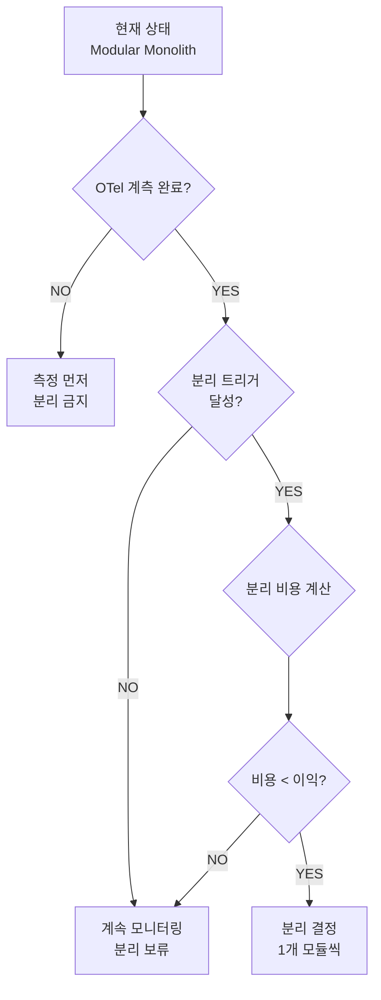

# 03. 언제 분리하는가 — 측정 기반 분리 판단

> 학습 목표: 측정 데이터 없이 분리를 결정하는 것이 왜 위험한지 설명하고, all-flow의 분리 트리거 기준을 구체적 수치로 설명할 수 있다.

---

## 1. 문제 정의 — "느낌"으로 분리하는 위험

아키텍처 결정에서 가장 흔한 실수는 데이터 없이 느낌으로 분리하는 것이다.

```
잘못된 판단 과정:
"realtime 모듈이 꽤 복잡해 보이니까 분리하자"
→ 수 주 작업
→ 분리했는데 실제 병목은 search였음
→ 시간 낭비
```

올바른 판단 과정:
```
측정 → 병목 식별 → 분리 비용 계산 → 비용 < 이익이면 분리
```

---

## 2. 분리 트리거 기준 (all-flow PRD §2.2에서 발췌)

아래는 all-flow 프로젝트가 공식적으로 정의한 도메인별 분리 트리거다.

| 후보 도메인 | 모듈 위치 | 분리 트리거 | 우선순위 |
|------------|----------|------------|---------|
| **realtime** | `src/modules/realtime/` | WS 동시접속 1,000 초과 OR BE 재배포로 연결 단절이 사용자 통증으로 입증 | 1순위 |
| **ai** | `src/modules/ai/` | LLM 호출 평균 지연 > 2초 OR 비용 모니터링 필요 | 2순위 |
| **search** | `src/modules/search/` | pgvector 쿼리가 메인 DB CPU > 30% 점유 | 3순위 |

### 각 트리거의 근거

**realtime 1순위인 이유**:

realtime 모듈(`redis-fanout.ts`)은 WebSocket 연결을 유지한다.
BE 재배포 시 모든 WS 연결이 끊어진다. 분리하면 BE 재배포 영향 없이 realtime 서비스만 별도로 운영 가능.

```typescript
// project/all-flow-backend/src/modules/realtime/redis-fanout.ts (실제 코드)
export async function attachRedisFanout(
  bus: RealtimeBus,
  redisUrl: string,
): Promise<RedisFanoutHandle> {
  const publisher = new Redis(redisUrl, { lazyConnect: true, maxRetriesPerRequest: 1 });
  const subscriber = new Redis(redisUrl, { lazyConnect: true, maxRetriesPerRequest: 1 });
  // ...
}
```

이미 Redis를 통해 fan-out하는 구조이므로 분리 비용이 상대적으로 낮다.
하지만 **동시접속 1,000 초과 없이** 분리하면 분리 비용만 발생한다.

**search 3순위인 이유**:

pgvector(벡터 유사도 검색)는 CPU 집약적이다.
하지만 분리하면 인덱싱 동기화 복잡도가 높아진다.
CPU > 30%를 측정하기 전에 분리하면 낭비다.

---

## 3. 측정 없이 분리 금지



**이 흐름에서 "측정 먼저"가 강제되는 이유**:

OTel(OpenTelemetry) 계측이 없으면:
- 어느 모듈이 P99 지연의 원인인지 모른다
- DB 쿼리와 애플리케이션 코드 중 어느 쪽이 느린지 모른다
- 분리 후 개선됐는지 측정할 수 없다

---

## 4. Phase 2 분리 전 필요한 것

1개 모듈을 service로 분리하기 위해 Phase 1에서 준비해야 하는 것:

| 준비사항 | 목적 | Phase |
|---------|------|-------|
| OTel collector 도입 | 측정 데이터 수집 | Phase 1 후반 |
| packages/contracts SOR | service 간 API 계약 | Phase 1 |
| packages/shared | 공통 타입/유틸 공유 | Phase 1 |
| CI turbo cache | 분리 후 독립 빌드 | Phase 1 |
| 분리 트리거 달성 | 분리를 정당화하는 측정값 | Phase 2 전 |

---

## 5. "지금 분리 안 한다"는 결정의 근거

all-flow PRD에서 Phase 3(풀 분해)를 "비추천"으로 명시한 이유:

```
20개 모듈 전체 분리 시 비용:
- 인프라 비용 ~10배 (서비스당 컨테이너 + DB 풀 + 네트워킹)
- 로컬 dev 무결성 붕괴
  현재: single-port localhost 1줄 가동
  MSA:  20개 컨테이너 + service mesh
- 분산 트랜잭션 복잡도
  현재: Prisma 단일 트랜잭션
  MSA:  SAGA/Outbox 패턴 강제
```

이 비용이 이익을 초과한다는 것이 CNCF 2026 Q1(42% 회귀)이 보여주는 데이터다.

---

## 6. 실제 분리 판단 예시

**시나리오**: "realtime 모듈 분리 여부를 결정해야 한다"

```
1. OTel 데이터 확인:
   WS 동시접속: 현재 최대 120명 → 1,000 미달
   BE 재배포 빈도: 하루 2회
   연결 단절 사용자 불만: 지라 이슈 없음

2. 트리거 달성 여부: NO

3. 결정: 분리 보류
   → 1,000 동시접속 달성 또는 재배포 연결 단절 불만 입증 시 재검토
```

이 판단 과정을 기록해두면 다음 개발자도 근거를 이해할 수 있다.

---

## 체크포인트

1. all-flow에서 `search` 모듈이 `realtime`보다 분리 우선순위가 낮은 이유는?

   **답**: `realtime`은 BE 재배포 시 WS 연결 단절이라는 사용자 통증이 측정 이전에도 명확하다. `search`는 pgvector CPU 30% 초과라는 측정 가능한 트리거가 있지만, 인덱싱 동기화 복잡도가 높아 분리 비용이 크다. 트리거 달성 없이는 비용 > 이익이다.

2. OTel 계측 없이 모듈을 분리했을 때 발생할 수 있는 문제 2가지를 설명하라.

   **답**: (1) 어느 모듈이 실제 병목인지 몰라 잘못된 모듈을 분리할 수 있다. (2) 분리 후 성능이 개선됐는지 측정할 수 없어 분리의 효과를 검증하지 못한다. 분리 비용만 발생하고 이익이 확인되지 않는 상황이 된다.

3. "현재 WS 동시접속이 120명인 all-flow에서 realtime 분리를 보류한다"는 결정을 5문장 이내로 정당화하라.

   **답**: 분리 트리거는 WS 동시접속 1,000 초과 또는 BE 재배포 연결 단절에 대한 사용자 불만 입증이다. 현재 최대 120명으로 트리거에 미달한다. 분리하면 Redis 공유 유지, JWT 공유 설정, 독립 배포 파이프라인 구성 비용이 발생한다. 이 비용이 현재 이익을 초과하므로 보류가 합리적이다. 트리거 달성 시 즉시 재검토한다.
