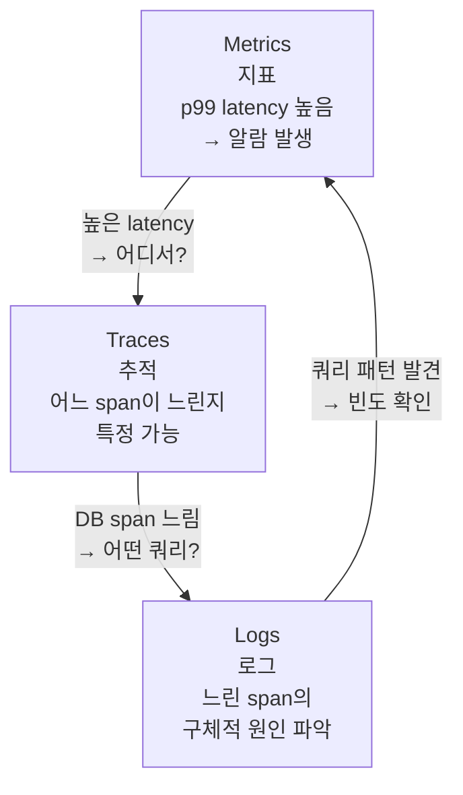

# 01. 관측 가능성의 3 기둥

> 학습 목표: Metrics / Logs / Traces 각각의 역할과 한계를 설명하고, 세 가지가 함께 필요한 이유를 실제 장애 시나리오로 설명할 수 있다.

---

## 1. 문제 정의 — "서버가 느린데 왜인지 모른다"

시스템에 장애가 발생했을 때 어디를 봐야 하는가?

```
사용자 신고: "태스크 저장이 느려요"

Logs만 있을 때:
  ERROR: Request timeout after 30s
  → 어디서 30초가 소요됐는지 알 수 없음

Metrics만 있을 때:
  p99 latency: 28,000ms
  → 전체 지연은 보이지만 어느 단계인지 알 수 없음

Traces만 있을 때:
  span: tasks.create → 28s
  sub-span: db.query → 28s
  → DB가 느린 것은 알지만, 어떤 쿼리인지 로그가 없으면 모름
```

세 가지가 연결될 때 비로소 문제를 파악할 수 있다.

---

## 2. 세 기둥의 정의

### 2.1 Metrics (지표)

**무엇인가**: 시간에 따른 수치 측정값의 집합.

특성:
- 집계(Aggregate) — 개별 요청이 아닌 시간 구간의 요약
- 저비용 — 숫자를 저장하므로 공간 효율이 높음
- 알람에 적합 — "p99 > 2초면 알람"

예시:
```
# 요청 처리량 (초당 요청 수)
http_requests_total{method="POST", path="/tasks"} = 150/s

# 응답 시간 분포
http_request_duration_seconds{quantile="0.99"} = 2.1

# 에러율
http_errors_total{code="500"} = 3/s
```

all-flow에서 필요한 주요 지표:
- API 응답 시간 (p50, p95, p99)
- WS 연결 수 (realtime 분리 트리거 측정)
- DB 쿼리 시간 (search 분리 트리거 측정)
- LLM 호출 비용/시간 (ai 분리 트리거 측정)

### 2.2 Logs (로그)

**무엇인가**: 특정 시점에 발생한 이벤트의 텍스트 기록.

특성:
- 상세(Verbose) — 이벤트의 구체적 내용 포함
- 고비용 — 텍스트를 저장하므로 공간 비용이 높음
- 디버깅에 적합 — "이 요청에서 정확히 무슨 일이 있었나"

예시:
```json
{
  "level": "error",
  "time": "2026-04-30T10:30:00Z",
  "traceId": "abc123",  // Trace와 연결 핵심
  "userId": "user-001",
  "msg": "DB query timeout",
  "query": "SELECT * FROM tasks WHERE projectId = $1",
  "duration": 28000
}
```

`traceId` 필드가 핵심이다. Trace와 Log를 연결하는 고리다.

### 2.3 Traces (추적)

**무엇인가**: 단일 요청이 여러 서비스/컴포넌트를 거치는 흐름의 기록.

특성:
- 인과관계(Causality) — A가 B를 호출했고, B가 C를 호출했음을 보여줌
- 중간 비용 — span 단위 데이터
- 성능 분석에 적합 — "어느 단계에서 시간이 얼마나 걸렸나"

예시:
```
Trace: POST /api/v1/tasks (100ms 총 소요)
  └─ span: auth.verify (2ms)
  └─ span: tasks.validate (3ms)
  └─ span: db.query (90ms)  ← 여기서 지연 발생
      └─ span: prisma.tasks.create (90ms)
```

---

## 3. 세 기둥의 관계



실제 장애 해결 흐름:

```
1. Metrics 알람: p99 latency 28초 (임계값 2초 초과)
2. Traces 조회: traceId abc123 → db.query span에서 28초 소요
3. Logs 조회: traceId="abc123" → "SELECT * FROM tasks WHERE projectId = $1, duration=28000ms"
4. 원인 파악: projectId 인덱스 없음 → 풀 테이블 스캔
5. 수정: ALTER TABLE tasks ADD INDEX idx_project_id
```

---

## 4. 2026 트렌드 — 4번째 기둥: Profiling

2026년 OTel(OpenTelemetry)은 4번째 기둥인 **Continuous Profiling**을 RC로 추가했다.

| 기둥 | 질문 | OTel 상태 |
|------|------|----------|
| Metrics | "뭔가 이상한가?" | Stable |
| Logs | "정확히 무슨 일이 있었나?" | Stable |
| Traces | "어느 단계가 느린가?" | Stable |
| Profiling | "어느 코드 줄이 CPU를 먹는가?" | RC (2026 Q1) |

all-flow Phase 1에서는 Metrics + Traces + Logs 3기둥만 다룬다.
Profiling은 Phase 2 이후 검토.

---

## 5. 3 기둥이 없을 때의 비용

측정 없이 분리 결정을 내리는 것이 왜 위험한지 다시 연결:

```
OTel 3기둥이 없는 상태에서 "ai 모듈이 느린 것 같아 분리한다" →
- 실제로는 search 모듈의 pgvector 쿼리가 원인이었음
- ai 분리 비용(2주)을 썼지만 문제 미해결
- search도 따로 분리하면 추가 2주
- 처음부터 OTel 도입(1주)했으면 원인 파악 후 1번만 작업

측정 없는 분리 = 추측에 기반한 최적화 = 높은 확률로 낭비
```

---

## 체크포인트

1. Metrics, Logs, Traces 중 "p99 API 응답 시간이 28초를 초과했다"는 사실을 알 수 있는 것은 무엇인가?

   **답**: Metrics다. Metrics는 시간 구간의 집계 수치를 저장한다. p99는 "상위 1%의 응답 시간"을 의미하며, 알람 설정에 적합하다.

2. Logs에 `traceId` 필드를 포함해야 하는 이유는?

   **답**: `traceId`는 Logs와 Traces를 연결하는 고리다. 특정 요청에서 어떤 로그가 발생했는지 추적하려면 log의 `traceId`와 trace의 `traceId`가 일치해야 한다. 없으면 "이 로그가 어떤 요청에서 발생했는지" 알 수 없다.

3. all-flow에서 realtime 모듈의 분리 트리거를 측정하려면 어떤 Metric을 수집해야 하는가?

   **답**: WebSocket 동시접속 수 (active connections count)를 수집해야 한다. 트리거 기준이 "1,000 동시접속 초과"이므로, 이 수치를 시계열로 추적하여 임계값 알람을 설정해야 한다.
