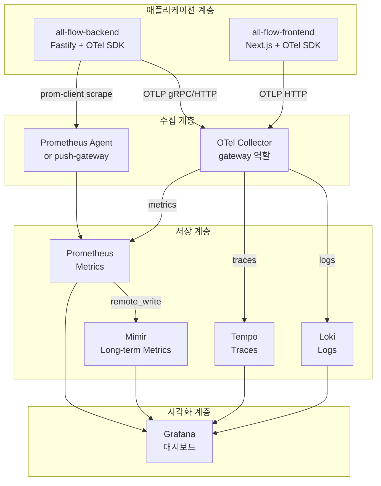

# 03. Grafana 스택 — Loki / Tempo / Mimir / Prometheus

> 학습 목표: Grafana 스택의 각 컴포넌트가 3 기둥 중 어느 것을 담당하는지 설명하고, 컴포넌트 간 데이터 흐름을 설명할 수 있다.

---

## 1. 문제 정의 — 왜 Grafana 스택인가

관측 가능성 플랫폼 선택지:

| 플랫폼 | 비용 | 벤더 종속 | 오픈소스 |
|--------|------|---------|---------|
| Datadog | 높음 (사용량 기반) | 높음 | 아니오 |
| New Relic | 높음 | 높음 | 아니오 |
| **Grafana Stack** | 낮음 (셀프 호스트 무료) | 낮음 | 예 |
| Elastic Stack | 중간 | 중간 | 일부 |

all-flow는 단일 개발자 프로젝트다. Datadog의 비용은 트래픽 증가 시 선형으로 늘어난다.
Grafana Stack은 셀프 호스트 시 OTel Collector + 각 서비스를 docker-compose로 띄울 수 있다.

---

## 2. Grafana 스택 컴포넌트 역할

| 컴포넌트 | 3 기둥 | 역할 | 유사 도구 |
|---------|--------|------|---------|
| **Prometheus** | Metrics | 지표 수집 + 저장 (pull 방식) | InfluxDB |
| **Loki** | Logs | 로그 집계 + 저장 (레이블 기반) | Elasticsearch |
| **Tempo** | Traces | 분산 추적 저장 + 조회 | Jaeger, Zipkin |
| **Mimir** | Metrics (장기) | Prometheus 장기 저장 + 수평 확장 | Thanos |
| **Grafana** | 시각화 | 4개 데이터소스 통합 대시보드 | Kibana |

---

## 3. 스택 구조도



---

## 4. 각 컴포넌트 상세

### 4.1 Prometheus — 지표 수집

Prometheus는 **pull 방식**이다. 애플리케이션이 `/metrics` 엔드포인트를 노출하면 Prometheus가 주기적으로 scrape한다.

```typescript
// all-flow-backend에 Prometheus 지표 노출 예시
import { register } from 'prom-client';

fastify.get('/metrics', async (req, reply) => {
  reply.header('Content-Type', register.contentType);
  return register.metrics();
});
```

Prometheus가 자동으로 scrape할 지표:
- `http_requests_total` — 요청 수 (자동 계측)
- `http_request_duration_seconds` — 응답 시간 (자동 계측)
- `process_cpu_seconds_total` — CPU 사용률
- `process_resident_memory_bytes` — 메모리

### 4.2 Loki — 로그 집계

Loki는 Elasticsearch와 달리 **전문(full-text) 인덱싱을 하지 않는다**.
대신 레이블(label) 기반으로 로그를 분류한다.

```
레이블 기반 쿼리:
{app="all-flow-backend", level="error"} |= "timeout"

전체 인덱싱 불필요 → 저비용
```

all-flow pino 로그를 Loki로 보내는 방법:

```typescript
// Fastify pino-loki transport (예시)
import { createWriteStream } from 'pino-loki';

const transport = createWriteStream({
  batching: true,
  labels: { app: 'all-flow-backend' },
  host: process.env.LOKI_HOST ?? 'http://localhost:3100',
});

const fastify = Fastify({ loggerInstance: pino({ level: 'info' }, transport) });
```

### 4.3 Tempo — 분산 추적

Tempo는 TraceId로 trace를 조회한다.
Loki와 통합하면 로그에서 traceId 클릭 → Tempo에서 trace 자동 연결이 가능하다.

OTel Collector에서 Tempo로 전달:

```yaml
# otel-collector-config.yaml (예시)
exporters:
  otlp/tempo:
    endpoint: "http://tempo:4317"

service:
  pipelines:
    traces:
      exporters: [otlp/tempo]
```

### 4.4 Mimir — 장기 지표 저장

Prometheus는 기본적으로 로컬 디스크에 저장한다 (기본 보관 기간 15일).
Mimir는 Prometheus의 `remote_write`를 받아 장기 보관 + 수평 확장을 제공한다.

초기 Phase에서는 Mimir 없이 Prometheus 단독으로 시작해도 된다.

---

## 5. all-flow에서의 도입 순서

```
Phase 1 후반:
1. OTel Collector 컨테이너 추가 (docker-compose.dev.yml)
2. Grafana + Tempo 추가 (traces 먼저)
3. Prometheus + Grafana 연결 (metrics)
4. Loki 추가 (logs — pino transport)

Phase 2:
5. Mimir 추가 (장기 보관 필요 시)
6. 알람 룰 설정 (분리 트리거 임계값)
```

---

## 체크포인트

1. Loki가 Elasticsearch와 다르게 전문 인덱싱을 하지 않는 이유와 그 트레이드오프를 설명하라.

   **답**: Loki는 레이블(app, level, 환경 등) 기반으로만 인덱싱하여 저장 비용을 대폭 줄인다. 트레이드오프는 레이블에 포함되지 않은 로그 내용 기반 검색이 느리다는 점이다. Elasticsearch는 전문 인덱싱으로 빠른 검색이 가능하지만 저장 비용이 10배 이상 높다.

2. Prometheus의 pull 방식이란 무엇인가? 반대 방식(push)과 비교하라.

   **답**: Pull 방식은 Prometheus가 주기적으로 애플리케이션의 `/metrics` 엔드포인트를 호출하여 지표를 가져온다. Push 방식은 애플리케이션이 지표 서버로 능동적으로 데이터를 보낸다. Pull의 장점은 Prometheus가 scrape 대상을 중앙에서 관리하고, 애플리케이션이 Prometheus를 알 필요 없다는 것이다.

3. Grafana에서 로그를 보다가 traceId를 클릭했을 때 Tempo에서 바로 trace가 열리려면 어떤 설정이 필요한가?

   **답**: (1) 로그에 `traceId` 필드가 포함되어야 한다 (OTel SDK의 log correlation 기능). (2) Grafana에서 Loki 데이터소스에 "Derived Fields" 설정으로 `traceId` 패턴을 정의하고, Tempo 데이터소스로 연결되도록 설정한다. 이 설정으로 로그의 traceId 클릭 시 Tempo에서 해당 trace를 자동으로 조회한다.
