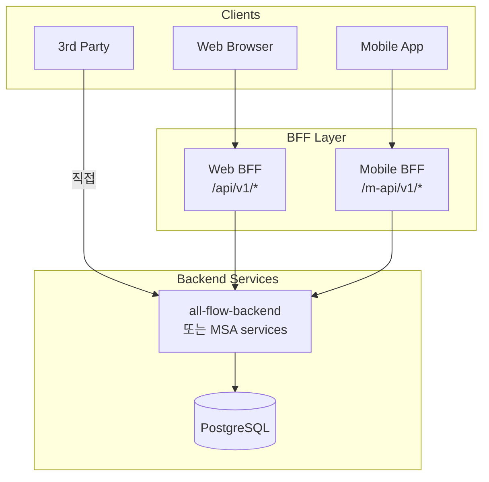
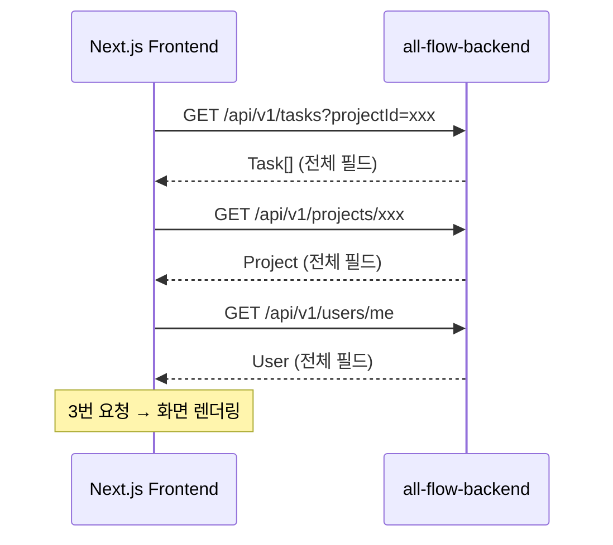
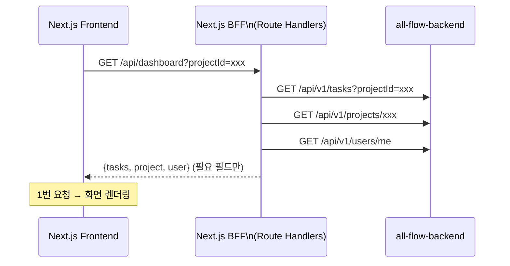

# 01. BFF 패턴 — Backend for Frontend

> 학습 목표: BFF가 어떤 문제를 해결하는지 설명하고, all-flow FE ↔ BE 구조에 BFF를 도입했을 때 어떻게 달라지는지 비교할 수 있다.

---

## 1. 문제 정의 — "모바일과 웹이 같은 API를 써야 하나?"

단일 백엔드가 다양한 클라이언트(Web, Mobile, 3rd-party)를 모두 서비스하면:

```
문제 1: 오버페칭 (Over-fetching)
  모바일: Task 목록에서 title + dueDate만 필요
  BE API: title, description, assignees, tags, comments, attachments, ... 전부 반환
  → 모바일이 필요 없는 데이터를 받아 처리

문제 2: 언더페칭 (Under-fetching)
  웹 대시보드: Task + User + Project 정보를 한 화면에 표시
  BE API: 각각 별도 엔드포인트
  → FE에서 3번 API 호출 필요 (waterfall)

문제 3: API 버전 관리
  웹 리팩토링으로 API 응답 구조 변경 필요
  → 같은 API를 쓰는 모바일앱도 영향 받음
```

---

## 2. BFF란

BFF(Backend for Frontend)는 특정 클라이언트 유형을 위해 최적화된 중간 API 계층이다.



각 BFF는:
- 해당 클라이언트에 필요한 필드만 반환 (오버페칭 해결)
- 여러 API 호출을 집계 (언더페칭 해결)
- 클라이언트별 독립 변경 가능 (버전 관리 해결)

---

## 3. all-flow 현재 구조 vs BFF 도입 후

### 현재 구조 (BFF 없음)



### BFF 도입 후 (Phase 2+ 고려 시)



---

## 4. Next.js Route Handlers가 BFF 역할을 하는 경우

all-flow-frontend에는 이미 Next.js Route Handlers가 있다.
이 파일들이 사실상 "웹 BFF" 역할을 할 수 있다.

```typescript
// apps/frontend/src/app/api/dashboard/route.ts (예시)
import { auth } from '@/auth';
import { getBackendClient } from '@/lib/api/http';

export async function GET(req: Request) {
  const session = await auth();
  if (!session) return Response.json({ error: 'Unauthorized' }, { status: 401 });

  const { searchParams } = new URL(req.url);
  const projectId = searchParams.get('projectId');

  const api = getBackendClient(session.accessToken);

  // 병렬 요청으로 언더페칭 해결
  const [tasks, project, user] = await Promise.all([
    api.get(`/tasks?projectId=${projectId}`).json(),
    api.get(`/projects/${projectId}`).json(),
    api.get('/users/me').json(),
  ]);

  // 필요한 필드만 선택하여 반환 (오버페칭 해결)
  return Response.json({
    tasks: tasks.map((t: any) => ({ id: t.id, title: t.title, dueDate: t.dueDate })),
    project: { id: project.id, name: project.name },
    user: { id: user.id, name: user.name },
  });
}
```

---

## 5. BFF를 지금 도입하지 않는 이유

현재 all-flow는 단일 클라이언트(웹 브라우저)만 있다.

BFF 도입이 필요한 신호:
- 모바일 앱 개발 시작 → 클라이언트 유형 2개 이상
- FE에서 동일 API를 3번 이상 호출하는 waterfall 패턴이 성능 문제로 입증
- 클라이언트별 독립 배포 필요

현재 next-auth + catch-all proxy 구조에서 Next.js Route Handlers가
이미 경량 BFF 역할을 수행하고 있다.
완전한 BFF 레이어 분리는 Phase 2 이후 클라이언트 다양화 시 검토한다.

---

## 체크포인트

1. 오버페칭과 언더페칭의 차이를 all-flow 예시로 설명하라.

   **답**: 오버페칭은 BE가 Task 목록 조회 시 title만 필요한데 comments, attachments 등 전체 필드를 반환하는 것이다. 언더페칭은 웹 대시보드에서 Task + Project + User를 한 화면에 보여주기 위해 3번의 API 호출이 필요한 것이다. BFF는 클라이언트 요구에 맞게 데이터를 집계하거나 필터링하여 두 문제를 모두 해결한다.

2. all-flow에 모바일 앱 개발이 시작된다면 BFF를 도입해야 하는 이유를 2가지 설명하라.

   **답**: (1) 모바일은 대역폭과 배터리 제약으로 웹보다 더 적은 데이터를 필요로 한다. 같은 API를 공유하면 모바일이 필요 없는 필드를 항상 받아 처리해야 한다. (2) 웹 UI 변경으로 API 응답 구조를 바꾸면 모바일앱도 영향을 받는다. BFF를 분리하면 클라이언트별로 독립적으로 변경할 수 있다.

3. Next.js Route Handlers가 "경량 BFF" 역할을 한다는 것의 의미는?

   **답**: Next.js Route Handlers는 서버 측에서 실행되며 BE API를 호출한 뒤 응답을 가공하여 FE에 반환할 수 있다. 여러 BE API 호출을 병렬로 집계하거나, 클라이언트에 필요한 필드만 선택하는 변환 계층 역할을 한다. 별도의 BFF 서비스 없이 Next.js 앱 내에서 BFF 기능을 구현할 수 있다.
