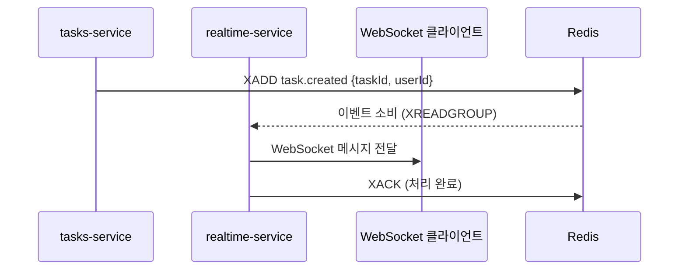

# 02. 이벤트 드리븐 아키텍처 — NATS / Redis Streams / Kafka

> 학습 목표: NATS, Redis Streams, Kafka의 트레이드오프를 설명하고, all-flow realtime 모듈의 Redis fan-out이 이벤트 드리븐의 초보적 형태임을 설명할 수 있다.

---

## 1. 문제 정의 — 동기 호출의 한계

MSA에서 서비스 간 통신은 크게 두 가지다:

```
동기 (Synchronous):
  A 서비스가 B 서비스를 직접 호출
  A --HTTP--> B
  단점: B가 느리면 A도 기다림. B가 죽으면 A도 실패.

비동기 (Asynchronous / Event-driven):
  A 서비스가 이벤트를 발행 → 브로커
  B, C, D 서비스가 필요할 때 이벤트 소비
  장점: A는 B가 처리했는지 기다리지 않음. B가 죽어도 이벤트는 브로커에 보관.
```

Modular Monolith에서도 이벤트 드리븐 패턴은 모듈 간 결합도를 낮추는 데 유용하다.

---

## 2. all-flow realtime 모듈 — Redis Pub/Sub 현재 구조

all-flow는 이미 Redis Pub/Sub을 사용한다.
`/data/allflow/project/all-flow-backend/src/modules/realtime/redis-fanout.ts`의 실제 코드:

```typescript
const CHANNEL = 'realtime:global';

export async function attachRedisFanout(
  bus: RealtimeBus,
  redisUrl: string,
): Promise<RedisFanoutHandle> {
  const publisher = new Redis(redisUrl, { lazyConnect: true, maxRetriesPerRequest: 1 });
  const subscriber = new Redis(redisUrl, { lazyConnect: true, maxRetriesPerRequest: 1 });

  await publisher.connect();
  await subscriber.connect();
  await subscriber.subscribe(CHANNEL);

  subscriber.on('message', (channel, message) => {
    if (channel !== CHANNEL) return;
    const parsed = parseWire(message);
    if (!parsed) return;
    bus.deliverLocal(parsed.event, opts);
  });

  bus.setPublishHook((event, options) => {
    void publisher.publish(CHANNEL, JSON.stringify(wire));
    return true;  // subscriber echo를 통해 fan-out
  });
  // ...
}
```

이 코드가 하는 일:
- 이벤트 발행: `publisher.publish('realtime:global', message)`
- 이벤트 수신: `subscriber.on('message', ...)` → WS/SSE 클라이언트에 전달

이것이 이미 "이벤트 드리븐"의 초보적 형태다.
한계: Redis Pub/Sub은 메시지가 소비되지 않으면 사라진다 (at-most-once).

---

## 3. 메시지 브로커 비교

| 항목 | Redis Pub/Sub | Redis Streams | NATS | Kafka |
|------|:-------------:|:-------------:|:----:|:-----:|
| 현재 all-flow 사용 | ✅ | — | — | — |
| 메시지 영속성 | ❌ | ✅ | ✅ (JetStream) | ✅ |
| 메시지 재처리 | ❌ | ✅ | ✅ | ✅ |
| 설치 복잡도 | 낮음 | 낮음 | 낮음 | 높음 |
| 처리량 | 높음 | 높음 | 매우 높음 | 매우 높음 |
| 학습 곡선 | 낮음 | 낮음 | 중간 | 높음 |
| 적합한 규모 | 소~중 | 소~중 | 중~대 | 대 |

### Redis Pub/Sub (현재)

```
장점: 이미 Redis가 설치되어 있음. 추가 서비스 불필요.
단점: at-most-once. 구독자가 없으면 메시지 소실.
     Consumer group 없음 → 수평 확장 어려움.
적합: 실시간 알림, WS 메시지 (all-flow 현재 사용 케이스)
```

### Redis Streams

```
장점: Redis를 그대로 사용. 영속성 + Consumer group 추가.
단점: Pub/Sub보다 복잡한 API.
적합: Pub/Sub에서 업그레이드, 메시지 재처리가 필요한 경우
     all-flow realtime 모듈 고도화 시 1순위 후보
```

### NATS

```
장점: 매우 빠른 처리량. JetStream으로 영속성 지원. 간단한 설정.
단점: 새 서비스 추가. Kafka보다 생태계 작음.
적합: MSA 간 경량 통신. realtime 분리 후 서비스 간 통신
```

### Kafka

```
장점: 대용량 스트리밍. 메시지 보관 기간 무제한. 강력한 생태계.
단점: 높은 운영 복잡도. ZooKeeper 또는 KRaft 필요. 오버엔지니어링 위험.
적합: 일 수백만 이벤트. 데이터 파이프라인. all-flow 현재 규모에서는 과잉.
```

---

## 4. all-flow에서 이벤트 드리븐 적용 시나리오

**시나리오**: realtime 모듈 분리 후 서비스 간 통신



**현재와의 차이**:

현재 (동기 모듈 간 호출):
```typescript
// tasks 모듈에서 직접 realtime bus 호출
import { realtimeBus } from '../realtime/realtime-bus.js';
realtimeBus.publish({ type: 'task.created', payload: task });
```

분리 후 (Redis Streams):
```typescript
// tasks-service: 이벤트 발행 (realtime-service를 모름)
await redis.xadd('task.created', '*', 'taskId', task.id, 'userId', userId);
```

---

## 5. 지금 Kafka를 도입하면 안 되는 이유

all-flow 현재 상황:
- 일일 이벤트 수: 수천 건 (추정)
- 팀 규모: 1명
- 인프라: single-port localhost + docker-compose

Kafka 도입 비용:
- ZooKeeper 또는 KRaft 설정 (별도 컨테이너)
- Topic 관리, Partition 설계
- Consumer group 운영
- 장애 시 복구 절차

Kafka는 일 수백만 이벤트, 여러 팀이 서로 다른 소비 속도로 처리하는 상황에서 가치가 있다.
현재 규모에서 도입하면 운영 복잡도만 높아진다.

---

## 체크포인트

1. Redis Pub/Sub의 "at-most-once" 특성이 all-flow realtime 모듈에서 어떤 위험을 만드는가?

   **답**: WS 클라이언트가 연결되지 않은 상태에서 발행된 이벤트는 소실된다. 예를 들어 Task 생성 이벤트를 발행했는데 WS 구독자가 없으면 이벤트가 사라진다. 알림 유실, 실시간 업데이트 누락 등이 발생할 수 있다. 영속성이 필요하면 Redis Streams로 업그레이드해야 한다.

2. Redis Streams가 Redis Pub/Sub보다 realtime 모듈 고도화에 적합한 이유 2가지를 설명하라.

   **답**: (1) 메시지 영속성: Pub/Sub은 구독자 없으면 소실되지만 Streams는 디스크에 저장. (2) Consumer group 지원: Streams는 여러 인스턴스가 같은 스트림을 병렬로 소비 가능 (수평 확장 지원). Pub/Sub에서 Redis만 유지하면서 업그레이드 가능하므로 비용이 낮다.

3. all-flow 현재 규모(일 수천 이벤트, 1인 팀)에서 Kafka를 도입하지 않는 가장 중요한 이유는?

   **답**: 운영 복잡도 대비 이익이 없다. Kafka는 ZooKeeper/KRaft 관리, Topic 설계, Partition 운영, 장애 복구 절차 등 상당한 운영 부담을 요구한다. 현재 Redis Streams로 충분히 해결되는 규모에서 Kafka 도입은 오버엔지니어링이다.
