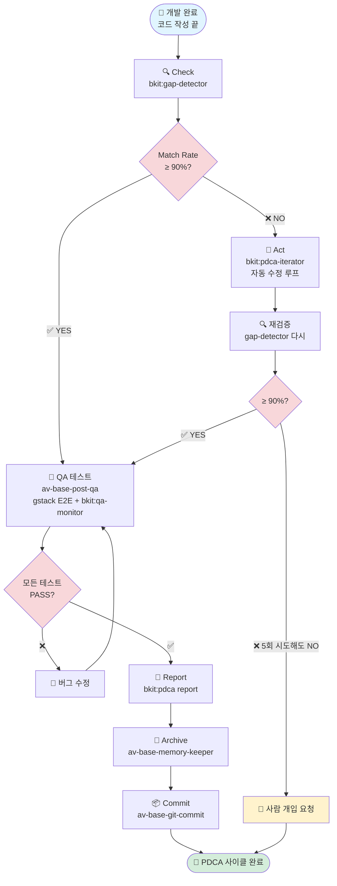
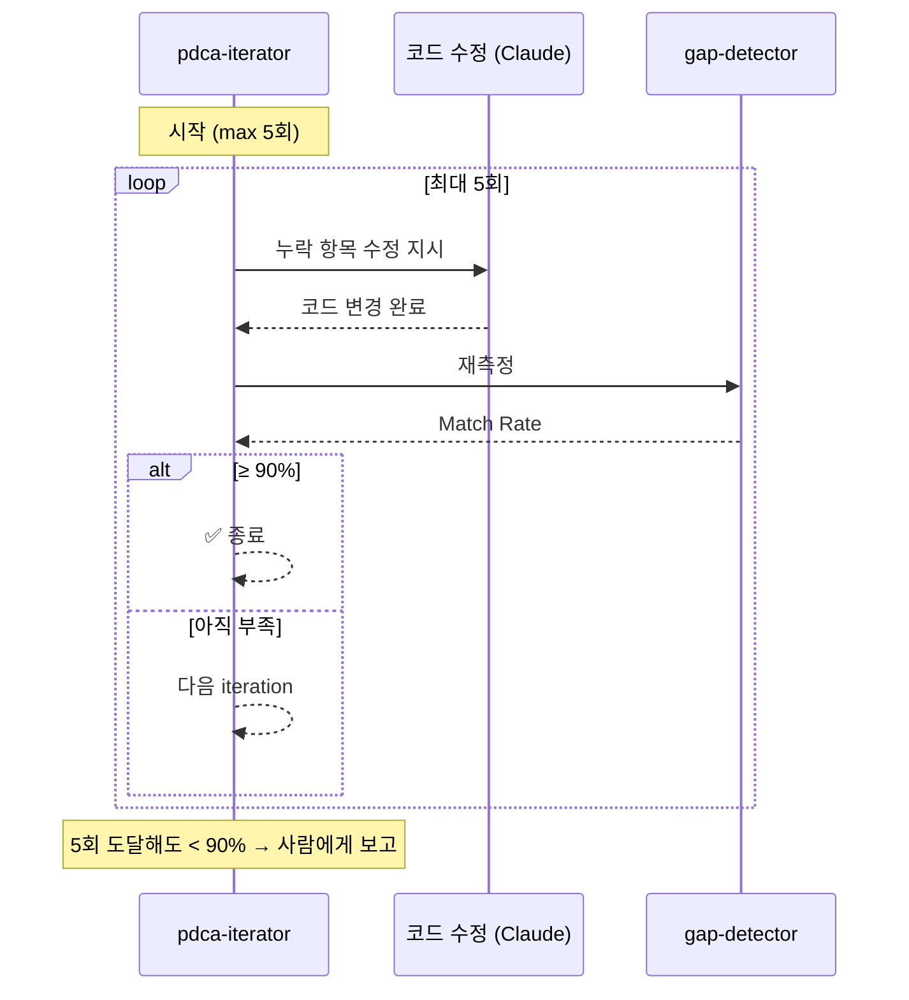
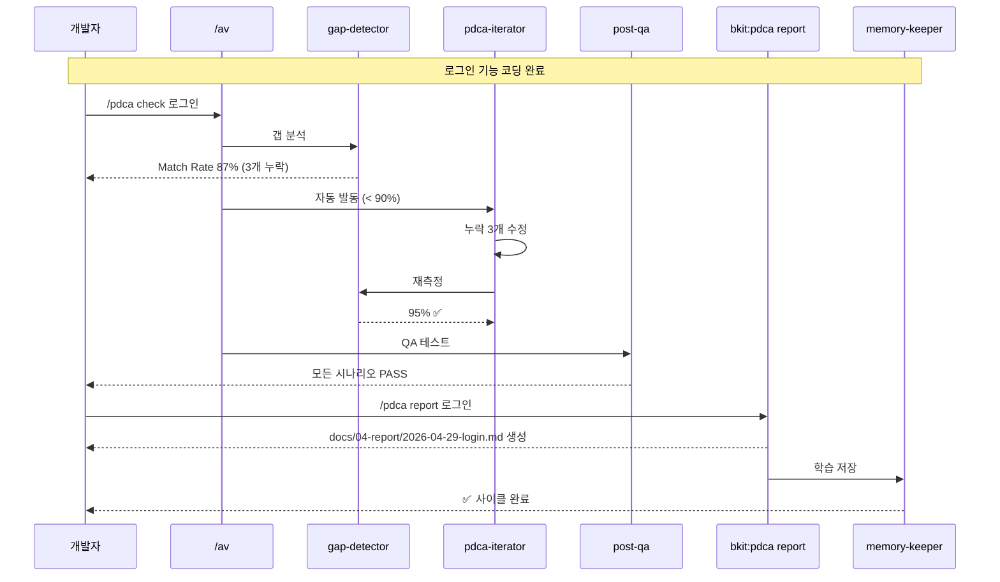

# 11. PDCA 개발 완료 후 프로세스

> **목표**: 개발(Do)이 끝난 후 무엇을 해야 하는지 단계별로 이해합니다.
> **대상**: PDCA를 처음 접하는 초급 개발자
> **소요 시간**: 15분 (읽기) / 첫 실습 30분

---

## 1. 왜 "개발 완료"가 끝이 아닌가?

코드를 다 짠 순간이 끝이라고 생각하기 쉽지만, **그건 PDCA의 절반**입니다.

```
PDCA = Plan(계획) → Do(개발) → Check(검증) → Act(개선)
                                    ↑
                              여기서부터가 시작
```

개발 완료 후에 하는 일은 크게 4가지입니다:

| 단계 | 무엇을 | 왜 |
|------|--------|-----|
| **Check** | 설계대로 만들었는지 검증 | 놓친 요구사항 찾기 |
| **Act** | 부족한 부분 자동 개선 | 90% 달성까지 반복 |
| **Report** | 작업 내용을 문서화 | 다음 사람(또는 미래의 나)이 이해하도록 |
| **Archive** | 학습 내용 메모리 저장 | 다음 작업에 재활용 |

**핵심 한 줄**: 개발이 끝나면 "내가 만든 것이 진짜 맞는지" 확인하고, "왜 이렇게 만들었는지"를 기록합니다.

---

## 2. 전체 흐름 한눈에 보기



**한 줄 설명**: 개발 → 검증 → (부족하면 자동 개선) → 테스트 → 보고서 → 메모리 저장 → 커밋. 이게 한 사이클.

---

## 3. 단계별 상세

### 3-1. Check (검증) — "내가 만든 게 진짜 설계대로인가?"

**왜**: 개발하다 보면 설계 문서에서 빠진 항목이 생깁니다. 사람 눈으로 다 못 봅니다.

**누가**: `bkit:gap-detector` 에이전트가 자동으로 합니다.

**무엇을**: `docs/02-design/` 의 설계 문서와 실제 코드를 비교해서 **Match Rate** 점수를 매깁니다.

```
설계에 적힌 기능 100개 중 95개가 코드에 있음 → Match Rate = 95%
```

**실행 명령**:
```bash
/pdca check {feature명}
# 또는
/av 이거 설계대로야?
```

**출력 예시**:
```
🔍 bkit:gap-detector 결과
━━━━━━━━━━━━━━━━━━━━━━━━━━━
Match Rate: 87.50% ⚠️
누락 항목 (3개):
  • 비밀번호 재설정 이메일 발송
  • 로그인 실패 5회 잠금
  • 세션 타임아웃 30분
```

**판정 기준**:
- **≥ 90%**: 다음 단계(QA)로
- **< 90%**: Act(자동 수정) 단계로 분기

---

### 3-2. Act (개선) — "부족한 부분, AI가 직접 고쳐주자"

**언제**: Check에서 90% 미만일 때 **자동으로** 발동.

**누가**: `bkit:pdca-iterator` (= Generator-Evaluator 루프).

**어떻게 작동**:



**중요**: 자동 루프는 **최대 5회**까지만 돕니다. 그래도 안 되면 "사람이 결정해 주세요"라고 멈춥니다 — 무한 루프 방지.

---

### 3-3. QA (브라우저/런타임 테스트) — "실제로 동작하는가?"

**왜**: 코드가 컴파일되고 설계와 일치해도, 브라우저에서 실제 클릭하면 깨질 수 있습니다.

**누가**: `av-base-post-qa` 스킬이 두 가지를 동시에:
1. **gstack** — 헤드리스 브라우저로 E2E 테스트
2. **bkit:qa-monitor** — Docker 로그 실시간 감시

**실행 명령**:
```bash
/av-base-post-qa
# 또는
/av QA 테스트 해줘
```

**판정**: 모든 시나리오 PASS → Report. 하나라도 FAIL → 버그 수정 후 재시도.

---

### 3-4. Report (보고서) — "다음 사람을 위해 기록"

**왜**: 6개월 뒤 미래의 당신은 지금 작성한 코드를 기억하지 못합니다. 동료는 더 모릅니다.

**누가**: `bkit:pdca report {feature}` 명령이 자동으로 작성.

**무엇이 들어가나**:

| 섹션 | 내용 |
|------|------|
| Summary | 무엇을 만들었는가 (1~3줄) |
| Plan vs Reality | 계획 대비 실제 차이 |
| Decisions | 도중에 바꾼 설계 결정과 이유 |
| Lessons | 다음에 다르게 할 것 |
| Metrics | Match Rate, QA 통과율, 코드 품질 점수 |

**저장 위치**: `docs/04-report/{date}-{feature}.md`

---

### 3-5. Archive (학습 저장) — "패턴을 메모리에 영구 보존"

**왜**: 같은 실수를 두 번 하지 않기 위해. AutoVibe는 **자기 성장형 생태계**입니다.

**누가**: `av-base-memory-keeper` 에이전트.

**무엇을 저장**:
- 성공한 패턴 → 재사용
- 실패한 시도 → 회피
- 사용자 피드백 → 행동 변경

**저장 위치 (3계층)**:

| 계층 | 경로 | 용도 |
|------|------|------|
| L1 에이전트 | `.claude/agent-memory/{이름}/MEMORY.md` | 해당 에이전트만 봄 |
| L2 스킬 | `.claude/skills/{이름}/MEMORY.md` | 해당 스킬만 봄 |
| L4 글로벌 | `~/.claude/projects/{slug}/memory/` | 모두가 봄 |

---

### 3-6. Commit (커밋)

**누가**: `av-base-git-commit` 스킬.

**무엇을**: Conventional Commits 형식으로 커밋 메시지 자동 생성 + 커밋.

```bash
/av-base-git-commit
```

OSS 모드에서는 **DCO Signed-off-by** 자동 추가 (av-oss-sign-off 훅).

---

## 4. 실전 시나리오: 로그인 기능 완료 후



---

## 5. 자주 묻는 질문

**Q1. Check 단계에서 항상 90%를 넘어야 하나요?**
- 기본은 90%지만 프로젝트마다 조정 가능. `/pdca config` 에서 변경. Starter 레벨은 80% 권장.

**Q2. Iterate가 5회 다 실패하면 어떻게 되나요?**
- 자동 종료 + 콘솔에 "사람 개입 필요" 메시지. 보통 설계 자체가 모호한 경우이므로 PM에게 다시 물어봐야 합니다.

**Q3. Report를 매번 써야 하나요? 귀찮은데.**
- `bkit:pdca report` 가 자동 작성합니다. 손으로 쓰는 게 아닙니다. 5초.

**Q4. Memory에 너무 많이 쌓이면 느려지지 않나요?**
- `av-ecosystem-optimizer` 가 주기적으로 정리. 30일 이상 안 쓴 항목은 후보.

**Q5. OSS 프로젝트에서는 뭐가 추가되나요?**
- Report 후 → `/av-oss-pr-triage` (외부 PR 정리) → `/av-oss-release auto` (릴리즈) 흐름이 추가됩니다. 가이드 12 참고.

---

## 6. 다음 단계

- 이 가이드를 다 읽었다면 → **[12. PDCA Loop 개발 가이드](./12-PDCA-Loop-개발-가이드.md)** 로 자동화 단계로 진행
- 첫 실습 → `/av 작은 기능 만들어보고 PDCA 한 사이클 돌려보기`
- 막히면 → `/pdca status` 로 현재 단계 확인
