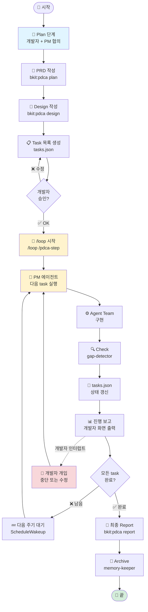
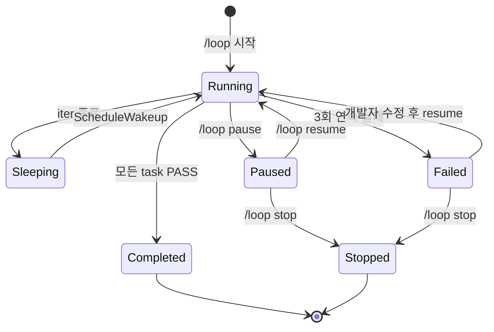

# 12. PDCA Loop 개발 가이드

> **목표**: PM 에이전트가 전체 task를 자동으로 반복 수행하고, 개발자는 진행 상태만 리뷰하는 워크플로우를 구축합니다.
> **대상**: Plan 단계까지는 직접 하고, Do 이후는 자동화하고 싶은 개발자
> **소요 시간**: 20분 (읽기) / 첫 루프 셋업 1시간
> **선행 학습**: [11. PDCA 개발 완료 후 프로세스](./11-PDCA-개발완료-후-프로세스.md)

---

## 1. PDCA Loop 가 뭔가?

**한 줄로**: 개발자와 PM이 **사전 협의**로 task 목록을 만들고, `/loop` 명령이 PM 에이전트를 **반복 호출**해서 모든 task가 끝날 때까지 자동으로 일을 시킵니다. 개발자는 매 루프마다 진행 상태를 확인하면 됩니다.

### 기존 방식 vs Loop 방식

| 항목 | 기존 (수동) | Loop 자동화 |
|------|------------|------------|
| Plan | 개발자 + PM 대화 | 개발자 + PM 대화 (동일) |
| Task 분할 | PM이 한 번 | PM이 한 번 (동일) |
| Task 실행 | 개발자가 매번 명령 | `/loop` 1회로 끝 |
| 진행 확인 | 매번 직접 확인 | 매 루프 자동 보고 |
| 종료 조건 | 개발자 판단 | task 100% 완료 시 자동 |

### 무엇이 자동화되고 무엇이 사람 책임인가?

```
┌─────────────────────────────────────────────────────┐
│                                                     │
│   👤 개발자 + PM이 사전 결정 (loop 시작 전)          │
│                                                     │
│   • 무엇을 만들 것인가 (PRD)                         │
│   • 어떻게 쪼갤 것인가 (task 목록)                   │
│   • 완료 기준 (Acceptance Criteria)                  │
│                                                     │
└─────────────────────────────────────────────────────┘
                       │
                       ▼
┌─────────────────────────────────────────────────────┐
│                                                     │
│   🤖 /loop + PM 에이전트가 자동 수행                 │
│                                                     │
│   • 다음 task 선택 → 실행 → Check → 다음으로         │
│   • 진행 보고서 생성                                 │
│   • 모든 task 완료 시 종료                           │
│                                                     │
└─────────────────────────────────────────────────────┘
                       │
                       ▼
┌─────────────────────────────────────────────────────┐
│                                                     │
│   👤 개발자: 매 루프 결과 리뷰 + 필요 시 개입         │
│                                                     │
└─────────────────────────────────────────────────────┘
```

---

## 2. 전체 흐름 한눈에 보기



---

## 3. 단계 1 — 사전 협의 (Plan)

### 3-1. PRD 작성: PM과 대화

```bash
/av-pm start 결제시스템
# 또는
/av 결제 시스템 만들고 싶어
```

PM 에이전트가 다음을 질문합니다:
- 어떤 결제 수단? (카드, 간편결제, 가상계좌)
- 정기결제 vs 단건?
- 환불 정책?
- 지원 통화?

→ 결과: `docs/01-prd/{feature}.md` 생성

### 3-2. Design 작성: 아키텍처 결정

```bash
/pdca design 결제시스템
```

PL(av-do-orchestrator)이 자동으로:
- 컴포넌트 구조
- API 스펙
- DB 스키마
- 외부 의존성

→ 결과: `docs/02-design/{feature}.md` 생성

### 3-3. Task 목록 생성

이 단계가 **Loop의 핵심 입력**입니다. Design 문서를 잘게 쪼개서 task 목록을 만듭니다.

**자동 생성**:
```bash
/pdca tasks 결제시스템
```

**결과 파일**: `.claude/state/tasks-{feature}.json`

```json
{
  "feature": "결제시스템",
  "created": "2026-04-29",
  "loop_config": {
    "max_iterations": 50,
    "check_interval_seconds": 1800,
    "stop_on_match_rate": 0.95,
    "auto_review_each_iter": true
  },
  "tasks": [
    {
      "id": "T-001",
      "title": "결제 도메인 entity 설계",
      "status": "pending",
      "priority": "high",
      "depends_on": [],
      "acceptance": "Order/Payment/Refund entity + 단위 테스트 통과",
      "owner_agent": "av-do-orchestrator"
    },
    {
      "id": "T-002",
      "title": "토스페이 SDK 통합",
      "status": "pending",
      "priority": "high",
      "depends_on": ["T-001"],
      "acceptance": "샌드박스 결제 1건 성공",
      "owner_agent": "av-do-orchestrator"
    }
    // ...
  ]
}
```

### 3-4. 개발자 승인

`/pdca tasks --review` 명령으로 task 목록을 검토하고 다음 중 선택:
- **승인** → loop 시작 가능
- **수정** → task 추가/삭제/순서 변경
- **재생성** → Design 부터 다시

> ⚠️ **중요**: 한 번 loop가 시작되면 자동으로 돌아갑니다. 시작 전 task 목록을 충분히 검토하세요.

---

## 4. 단계 2 — Loop 실행

### 4-1. 기본 명령

```bash
# 30분 간격으로 자동 진행 (default)
/loop /pdca-step 결제시스템

# 또는 PM이 자체 페이스로 (dynamic)
/loop /pdca-step 결제시스템 --dynamic

# 1시간 간격
/loop 1h /pdca-step 결제시스템
```

### 4-2. 매 iteration 에서 일어나는 일

```mermaid
sequenceDiagram
    participant LOOP as /loop runtime
    participant PM as PM 에이전트
    participant TASKS as tasks.json
    participant TEAM as Agent Team
    participant GAP as gap-detector
    participant DEV as 개발자

    LOOP->>PM: 깨움 (wake-up)
    PM->>TASKS: 다음 pending task 조회
    TASKS-->>PM: T-002 (토스페이 통합)

    PM->>TEAM: T-002 실행 위임
    TEAM-->>PM: 구현 완료

    PM->>GAP: T-002 acceptance 검증
    GAP-->>PM: PASS

    PM->>TASKS: T-002 status = "completed"

    PM->>DEV: 📊 진행 보고<br/>"T-002 완료 (3/15, 20%)"

    alt 더 남은 task 있음
        PM-->>LOOP: ScheduleWakeup(다음 주기)
    else 모든 task 완료
        PM->>DEV: ✅ 모든 task 완료
        PM-->>LOOP: 종료 신호
    end
```

### 4-3. Loop의 종료 조건

다음 중 **하나라도** 만족하면 자동 종료:

| 조건 | 설명 |
|------|------|
| 모든 task 완료 | `tasks.json` 의 모든 status가 `completed` |
| 최대 iteration 도달 | `loop_config.max_iterations` (기본 50) |
| 치명적 오류 | task 3회 연속 실패 → 사람 개입 요청 |
| 개발자 중단 | `Ctrl+C` 또는 `/loop stop` |
| Match Rate 도달 | 전체 평균 ≥ `stop_on_match_rate` (기본 95%) |

---

## 5. 단계 3 — 진행 리뷰 (개발자)

### 5-1. 매 루프 자동 보고서

각 iteration 종료 시 다음 형식으로 화면에 출력 + `docs/04-report/loop-{date}-{iter}.md` 저장:

```
🔁 PDCA Loop iter #5 (2026-04-29 14:30)
━━━━━━━━━━━━━━━━━━━━━━━━━━━━━━━━━━━━━━
이번 iteration: T-005 "환불 API 구현"
결과: ✅ PASS (gap 92%)

전체 진행률: 5/15 (33%)
  ✅ 완료: T-001, T-002, T-003, T-004, T-005
  🔄 진행 중: (없음)
  ⏳ 대기: T-006 ~ T-015

소요 시간: 8분 12초
다음 iteration: 30분 후 (15:00)
다음 task: T-006 "환불 정책 검증 로직"

⚠️ 이슈: (없음)
💡 개발자 액션: 진행 상태 OK 시 추가 작업 불필요
```

### 5-2. 개발자가 개입해야 할 때

| 상황 | 어떻게 |
|------|--------|
| Loop 일시 정지 | `/loop pause` |
| Loop 재개 | `/loop resume` |
| Loop 강제 종료 | `/loop stop` 또는 Ctrl+C |
| 특정 task 건너뛰기 | `tasks.json` 에서 해당 task `status: "skipped"` |
| Task 추가 | `/pdca tasks add "신규 task 설명"` |
| 진행 상태 즉시 확인 | `/pdca status` 또는 `/loop status` |

### 5-3. Loop 상태 머신



---

## 6. 실전 예시: "결제시스템" 끝까지

### 6-1. Day 1 (사람) — Plan + Tasks

```bash
# 09:00 — PM 대화
/av-pm start 결제시스템
# (15분 대화로 PRD 완성)

# 09:30 — Design 자동 생성
/pdca design 결제시스템

# 10:00 — Task 목록 검토
/pdca tasks 결제시스템
/pdca tasks --review
# (15개 task 확인 → 승인)

# 10:15 — Loop 시작
/loop /pdca-step 결제시스템
```

### 6-2. Day 1 (자동) — 자동 진행

```
10:15  iter #1  T-001 entity 설계      ✅ (8분)
10:45  iter #2  T-002 토스 SDK 통합     ✅ (12분)
11:15  iter #3  T-003 결제 API 구현     ⚠️ gap 78% → iterator 자동
11:45  iter #4  T-003 재시도            ✅ gap 94%
12:15  iter #5  T-004 환불 API          ✅
...
```

### 6-3. Day 2 (사람) — 매일 아침 리뷰

```bash
/loop status
# 어제 7개 완료, 오늘 새벽 2개 더 완료, 6개 남음

# 한두 개 살펴보기
/pdca review T-005
# 코드 확인 → OK
```

### 6-4. Day 3 — 자동 종료

```
🎉 모든 task 완료! (15/15)
최종 Match Rate: 96.5%
총 소요 시간: 14시간 (실 작업), 36시간 (벽시계)
다음 단계: /pdca report 결제시스템
```

---

## 7. 위험과 안전장치

| 위험 | 안전장치 |
|------|----------|
| 무한 루프 | `max_iterations` 제한 (기본 50) |
| 자원 소모 | iteration 간 sleep (default 30분) |
| 잘못된 방향 | 매 iter 보고서 + 개발자 개입 가능 |
| 코드 망가짐 | iter 시작 전 자동 git checkpoint |
| 비용 폭증 | iter 당 토큰 예산 초과 시 일시 정지 |
| 외부 영향 | Loop 안에서는 push/배포 금지 (read-only 외부) |

### 자동 git checkpoint

매 iteration 시작 시:
```bash
git stash push -u -m "loop-iter-{N}-pre"
```

문제 발생 시 즉시 복구:
```bash
/loop rollback {N}  # iter #N 직전 상태로
```

---

## 8. tasks.json 전체 스키마 (참조용)

```json
{
  "feature": "string (필수)",
  "created": "ISO 8601 date",
  "owner_developer": "string (인간 책임자)",
  "loop_config": {
    "max_iterations": 50,
    "check_interval_seconds": 1800,
    "stop_on_match_rate": 0.95,
    "auto_review_each_iter": true,
    "auto_checkpoint": true,
    "token_budget_per_iter": 50000
  },
  "tasks": [
    {
      "id": "T-001",
      "title": "...",
      "status": "pending|in_progress|completed|skipped|failed",
      "priority": "high|medium|low",
      "depends_on": ["T-id", ...],
      "acceptance": "검증 기준 (gap-detector 입력)",
      "owner_agent": "에이전트 이름",
      "iterations": 0,
      "started_at": null,
      "completed_at": null,
      "notes": "자동 누적되는 진행 메모"
    }
  ],
  "summary": {
    "total": 15,
    "completed": 0,
    "in_progress": 0,
    "pending": 15,
    "failed": 0,
    "match_rate_avg": null
  }
}
```

---

## 9. 자주 묻는 질문

**Q1. Loop 중에 새 task가 필요해지면?**
- `/pdca tasks add "..."` 로 동적 추가. 다음 iteration 부터 반영.

**Q2. PM 에이전트가 잘못된 task를 시작하면?**
- 즉시 `/loop pause` → `tasks.json` 수정 → `/loop resume`. 또는 해당 iter의 git checkpoint로 rollback.

**Q3. 24시간 돌려도 비용이 안전한가요?**
- `loop_config.token_budget_per_iter` 로 제한. 기본 50K tokens/iter × 50 iter = 약 $7.5 (Sonnet 기준). 정확한 비용은 모델 따라 다름.

**Q4. 여러 feature를 동시에 loop 돌릴 수 있나요?**
- 가능. `/loop /pdca-step feature1` 와 `/loop /pdca-step feature2` 를 별도 세션에서. 단, git 충돌 위험이 있으니 worktree 분리 권장 (`isolation: worktree`).

**Q5. 개발자 휴가 중 loop 가 멈추지 않나요?**
- 네, 사람 개입이 필요한 상황(failed, 모호함)이 아니면 계속 돕니다. 매 iter 보고서가 `docs/04-report/` 에 쌓이니 휴가 후 한 번에 검토.

**Q6. 새벽에 loop가 돌면 비용이 안 듭니까?**
- Anthropic API 는 시간대 가격 차이 없음. 다만 사람 리뷰가 늦어지므로 잘못된 방향이 누적될 수 있어 모니터링 필요.

---

## 10. 권장 시작 순서

1. **첫 실습**: 작은 feature(예: "할 일 목록 추가") 로 task 5개 정도부터
2. **두 번째**: max_iterations=10 으로 안전하게 시작
3. **익숙해지면**: max_iterations=50 + 24시간 무인 모드
4. **고급**: 여러 feature 병렬 (worktree isolation)

---

## 11. 다음 단계

- 처음이면 → [11. PDCA 개발 완료 후 프로세스](./11-PDCA-개발완료-후-프로세스.md) 부터
- 이미 익숙하면 → 첫 실습 `/av-pm start 작은-기능` → `/pdca tasks` → `/loop`
- OSS 프로젝트라면 → loop 종료 후 `/av-oss-release auto` 까지 자동화 가능
- 막히면 → `/loop status`, `/pdca status`, `/av 도와줘`
