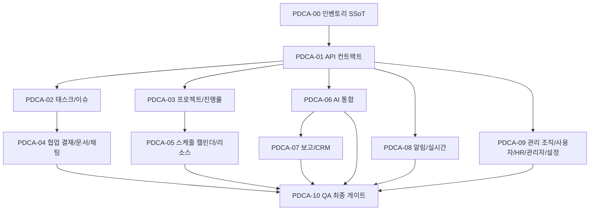

# all-flow-frontend PDCA 마스터 인덱스

> 작성: 2026-04-29 | Owner: PM (av-pm-coordinator) + PL (av-do-orchestrator)
> 목적: 사이드바 25개 메뉴 / 약 110개 버튼·기능을 빠짐없이 구현하기 위한 PDCA 11종 묶음.

## 산출 흐름

## 문서 목록

| # | 문서 | 단계 | 핵심 산출 |
|---|------|------|----------|
| 00 | [전체 메뉴/버튼 인벤토리](./00-menu-button-inventory.md) | Plan | 110개 컨트롤 SSoT 표 |
| 01 | [API 컨트랙트 정합](./01-foundation-api-contract.md) | Foundation | api.ts ↔ openapi.yaml 1:1 |
| 02 | [태스크/이슈 와이어링](./02-tasks-issues-wiring.md) | Core | CRUD + 보드 DnD + 일괄 |
| 03 | [프로젝트/진행률](./03-projects-progress.md) | Core | 동적 라우트 + 간트 |
| 04 | [협업: 결재/문서/채팅](./04-collaboration.md) | Collab | TipTap + 실시간 채팅 |
| 05 | [스케줄: 캘린더/리소스](./05-schedule.md) | Collab | OAuth + 충돌 검증 |
| 06 | [AI 통합](./06-ai-integration.md) | AI | 추출/요약/분류/Notion |
| 07 | [보고/CRM](./07-reports-crm.md) | Ops | PDF + 메일 발송 |
| 08 | [알림/실시간](./08-notifications-realtime.md) | Ops | SSE + 토스트 라우팅 |
| 09 | [관리: 조직/사용자/HR/콘솔/설정](./09-admin-org-hr-settings.md) | Governance | RBAC + SSO/SCIM |
| 10 | [QA 최종 게이트](./10-qa-a11y-i18n.md) | Verify | E2E + a11y + i18n |

## 인벤토리 요약 (PDCA-00 핵심 수치)

| 분류 | 개수 | 비고 |
|------|-----:|------|
| 메뉴 (사이드바 NAV 라우트) | 25 | 5개 섹션 |
| 가시 컨트롤 총합 | ~110 | 글로벌 14 + 화면 96 |
| wired (실제 동작) | 22 (20%) | 주로 로컬 state 토글 |
| decoration (시각만) | 88 (80%) | PDCA-02~09 와이어링 대상 |
| missing (있어야 하는 것) | 행 단위로 식별 | 각 PDCA 의 acceptance 기준 |

## 후속 운영

- **PM** (av-pm-coordinator) 가 본 인덱스를 사용자에게 제시하고 승인 요청.
- **PL** (av-do-orchestrator) 가 PDCA-01 부터 Agent Team 을 병렬 스폰.
- **bkit:gap-detector** 가 PDCA-00 인벤토리를 spec 입력으로 사용 → 매 머지마다 match_rate 측정.
- **memory-keeper** 가 학습한 패턴(`learning_*.md`)을 L4 글로벌 메모리에 저장.
- **av-docs-guard** 가 신규 메뉴/버튼 추가 시 PDCA-00 갱신을 강제.

## 중요 결정 (사용자 사전 고지 필요)

1. **신규 의존성**: `@dnd-kit/*` (PDCA-02), `@tiptap/*` (PDCA-04), `@axe-core/playwright` + `i18next` + `react-i18next` (PDCA-10), 간트 라이브러리 (PDCA-03 PoC 후 결정).
2. **기존 라우트 추가**: `/projects/[id]`, OAuth 콜백 페이지.
3. **백엔드 의존**: PDCA-01 의 누락 엔드포인트 24종이 백엔드에서 동시에 추가되어야 함 → all-flow-backend 와 contract 동기 필수.
4. **Phase 7 이연**: SSO/SCIM 변경 UI 는 본 문서 묶음에서 제외 (read-only 만).
